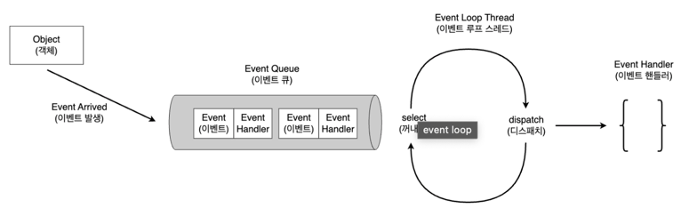

# EventLoop 이해하기
멀티플렉싱 I/O 를 쉽게 활용할 수 있게 해주는 Java 고성능 비동기 프레임워크인 Netty 를 사용하다 보면 자연스레 EventLoop 를 접하게 된다 <br>

Netty 의 핵심이라고도 할 수 있는 EventLoop 방식의 동작 원리는 이전 글에서 살펴본 멀티플렉싱 I/O를 기반으로 두고있다 <br>

여기서 말하는 EventLoop 는 개념에 대한 이해도를 높이기 위한 설명도 있다.<br>
실제 Netty 의 Single Thread EventLoop 와는 조금 차이가 있다. <br>
Netty 는 Multi Thread EventLoop 도 지원하므로, 이번 글을 통해 EventLoop 가 무엇이며 어떻게 동작하는 지만 이해하기를 추천한다 <br>

## EventLoop 의 의미와 역할
EventLoop 는 특정 이벤트나 메시지가 발생할 때 까지 대기하다가 이벤트가 발생하면 디스패치 하는 디자인 패턴 혹은 구조체 이다 <br>
위 내용을 아래 그림으로 봐보자 <br>
<br>

그림을 보면 EventLoop 가 쉽게 이해되는데, 보통 EventLoop 는 EventLoop 와 Handler 로 구성된다 <br>

- EventLoop
  - 무한 반복문을 실행하며 이벤트가 발생할 때까지 대기하다가 이벤트가 발생하면 해당 이벤트를 처리할 수 있는 Handler 에게 디스패치 한다 <br>
  - 보통 특정 Channel 에 대한 이벤트를 큐에 삽입할 때, 해당 이벤트를 처리할 수 있는 Handler 도 같이 첨부해준다

처음 소켓이 열렸을 땐 accept() 하면서 해당 Channel 에 AcceptHandler 를 첨부해준다 <br>

- Handler
  - 이벤트를 받아 비즈니스 로직을 수행한다. (수행완료하고 결과에 맞는 이벤트를 다시 발행하기도 한다.)

그리고 이러한 EventLoop 를 Reactor Pattern 이라고도 부른다 <br>
EventLoop 가 더 일반적인 개녕이며, EventLoop 를 활용하여 구현한 패턴중 하나가 Reactor Pattern 이라고 볼 수 있다 <br>

```java

```

보통 Java 에서 Runnable 을 구현받는 이유는 **스레드를 통한 작업**을 실행할 때 구현을 받고는 한다. <br>
Runnable 인터페이스를 구현하는 객체는 '스레드 실행 가능 객체' 라고 불린다. <br>

### Handler
```java
public interface Handler {
	void handle();
}
```

이 예시에서는 Handler 가 Channel 1:1 관계를 가진다 (실제 Netty 는 Handler 를 pipeline 으로 여러개를 묶어서 사용할 수도 있다.) <br>

```java
public class ConnectionAcceptHandler implements Handler{

	private final ServerSocketChannel socketChannel;
	private final Selector selector;

	public ConnectionAcceptHandler (ServerSocketChannel socketChannel, Selector selector) {
		this.socketChannel = socketChannel;
		this.selector = selector;
	}

	@Override
	public void handle () {
		try {
			SocketChannel socket = socketChannel.accept();

			if(socket != null) {
				ToUpperCaseHandler toUpperCaseHandler = new ToUpperCaseHandler(selector, socket);
			}
		} catch (IOException e) {
			e.printStackTrace();
		}
	}

}
```

- 새로운 연결 요청 이벤트가 발생하는 채널은 NIO ServerSocketChannel 이다 
  - 그리고 이를 활용해 클라이언트의 연결을 수락하고 연결된 SocketChannel 을 가져온다.
- 위 ConnectionAcceptHandler 는 ServerSocketChannel 에서 새로운 연결 요청이 오면 매핑되는 Handler 이다. 
  - 새로운 연결 요청이 오면 accept() 후 해당 Socket 을 대문자 변환하는 ToUpperCaseHandler 로 매핑한다

```java
public class ToUpperCaseHandler implements Handler {
	private final SocketChannel socketChannel;
	private final SelectionKey selectionKey;
	private final ByteBuffer byteBuffer = ByteBuffer.allocate(256);

	public ToUpperCaseHandler (SocketChannel socketChannel, Selector selector) throws IOException {
		this.socketChannel = socketChannel;
		this.socketChannel.configureBlocking(false);

		this.selectionKey = this.socketChannel.register(selector, SelectionKey.OP_READ);
		this.selectionKey.attach(this);
	}

	@Override
	public void handle () {
		try {
			if(selectionKey.isReadable()) {
				handleReadEvent();
			}
			if(selectionKey.isWritable()) {
				handleWriteEvent();
			}
		} catch (IOException e) {
			closeSocket(socketChannel);
			throw new UncheckedIOException(e);
		}
	}

	private void handleReadEvent() throws IOException {
		// 데이터 읽기
		int data = socketChannel.read(byteBuffer);

		if (data == -1) {
			closeSocket(socketChannel);
		}

		if (data > 0) {
			byteBuffer.flip();
			// 비즈니스 실행
			toUpperCase(byteBuffer);
			// 쓰기 모드로 전환
			selectionKey.interestOps(SelectionKey.OP_WRITE);
		}
	}

	private void handleWriteEvent() throws IOException {
		socketChannel.write(byteBuffer);

		while (!byteBuffer.hasRemaining()) {
			byteBuffer.compact();
			selectionKey.interestOps(SelectionKey.OP_READ);
		}
	}

	private static void closeSocket(SocketChannel socket) {
		try {
			socket.close();
		} catch (IOException e) {
			e.printStackTrace();
		}
	}

	private static void toUpperCase(final ByteBuffer byteBuffer) {
		// ByteBuffer내 모든 데이터를 읽어서 대문자로 변환한다.
		for (int x = 0; x < byteBuffer.limit(); x++) {
			byteBuffer.put(x, (byte) toUpperCase(byteBuffer.get(x)));
		}
	}

	private static int toUpperCase(int data) {
		return Character.isLetter(data) ? Character.toUpperCase(data) : data;
	}

}
```

SocketChannel 별로 매핑되는 Handler 이며, 읽기 혹은 쓰기 이벤트가 발생했을 때 그에 맞는 처리를 수행한다.

### 용어정리
- 이벤트 루프:특정 이벤트나 메시지가 발생할 때 까지 대기하다가 이벤트가 발생하면 디스패치
- 디스패치: 발생된 이벤트를 적절한 처리자에게 전달하는 과정
- os 디스패치: 프로세서 자원 할당과 컨텍스트 전환을 담당합니다.

ref: https://mark-kim.blog/understanding-event-loop/