# Netty Deep Dive
#### 이 글은 https://mark-kim.blog/netty_deepdive_1/ 글을 많이 참조하여 작성하였습니다.

<br>
Netty 는 가장 인기있는 비동기 이벤트 기반 프레임워크이다 <br> 

## I/O 모델
애플리케이션 프로세스에서 원격에 있는 디바이스와 데이터를 전송(write) 및 수신(read) 하기 위해선 OS 커널 System call 이 불가피하다<br.
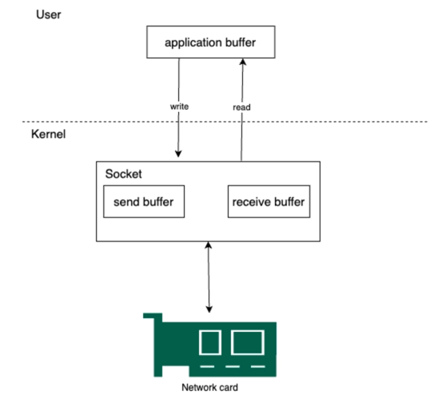<br>
- write System call : os 커널은 전송하고자 하는 데이터를 소켓 **전송** 버퍼에 복사한다.
- read System call : os 커널은 수신 받은 데이터를 소켓 **수신** 버퍼에 복사한다.

즉 write 는 전송을 하는거고(주는 것), read 는 읽어오는 것이다(받는 것) <br>

보통 이러한 OS 커널 작업은 대부분 DMA 가 네트워크 카드로부터 os 커널에 데이터를 버퍼에 복사하고 <br>
인터럽트를 발생시켜 애플리케이션 프로세스가 해당 데이터를 읽어가거나, 외부 디바이스에 데이터를 전송하게 된다 <br>

다시 말해 서로 다른 공간에 위치한 애플리케이션 간의 통신은 아래와 같이 Kernel 내 소켓과 소켓내 buffer 등을 활용하여 통신하게 된다 <br>
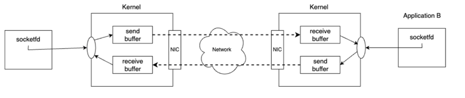 <br>
여기서 중요한 점은 통신을 위한 커널 소켓내 버퍼에 데이터를 어떻게 읽고 쓰기할지에 대한 I/O 모델은 Blocking I/O 와 Non-Blocking I/O 로 나뉜다 <br>

## OIO, NIO
### Network I/O
os 커널내 소켓 버퍼로부터 애플리케이션(프로세스)이 데이터를 read/write 하는 작업을 Network I/O 라 부른다 <br>
os 커널에 있는 소켓은 우리가 아는 was,ws 에 소켓이랑 다르다 <br>

was,ws 소켓은 애플리케이션에서 네트워크 통신을 위해 사용하는 소켓이다 <br>
커널 소켓은 운영체제 커널 내부에서 네트워크 통신을 처리하기 위해 사용하는 소켓이다, 완전 저수준 소켓이다 <br>

이때 네트워크 커널에 write, read 하기 위한 system call 은 애플리케이션 프로세스 관점에서 OIO, NIO 모드로 나뉜다 <br>

1) OIO(Blocking) 은 프로세스 내 Thread 가 커널에 system call(read/write) 하고 응답이 올 때까지 다른일을 하지 못하고 Blocking 되는 것을 말한다.
2) NIO(Non-Blocking) 은 프로세스 내 Thread 가 커널에 system call(read/write) 하고 응답과 상관없이 바로 return 되어 다른 일 수행하는 것을 말한다.

Blocking/Non-Blocking 은 제어권 관점에서 호출되는 함수의 리턴여부가 관심사이다<br>
쉽게 말해 함수 호출 후, 프로그램 흐름이 어떻게 진행되는지를 의미합니다 <br>

Blocking 을 경우 값이 반환될 때 까지 호출한 코드가 제어권을 가지고 있다, 즉 요청한 쪽이 제어권을 가지고 있다 <br>
Non-Blocking 을 경우 함수 호출 후 즉시 제어권을 반환한다. 다른 작업 수행 가능, 즉 제어권을 가지고 있는사람이 없다? 로 이해했다 <br>

#### Blocking(OIO) 방식보다 Non-Blocking(NIO) 방식이 효율적이다.
그럴 수 밖에 없다. 생각을 해보자 <br>
맥도날드 시켰는데, 시키고서 카운터 앞에서 시킨 사람이 비키질 않는다. 얼마나 화가날까? <br>

더 들어가 생각해보면, 자원을 낭비하고 있는 것이다.<br>
1:1 이어야 한다는 rule 이 없다. 기본이 그냥 1:1 관계를 가지고 있는 것이다 <br>

우리가 설정을 통해서 1:1 을 1:N 관계로 바꿀 필요가 있다 <br>
위 설정을 통해 컴퓨터 리소스를 제대로 활용하지 못하는 문제를 해결할 수 있다 <br>
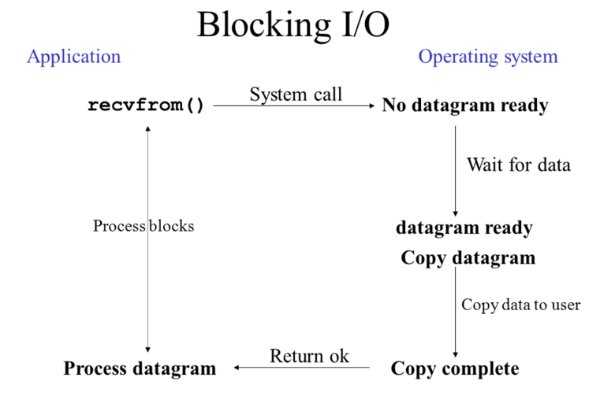<br>

Blocking 에서 컴퓨터 리소스를 제대로 활용하지 못하는 이유는 TCP 네트워킹에서 accept,read,write 등의 I/O 작업을 Blocking 하게 처리하기 때문이다 <br>
커널 소켓을 연결 및 처리하는 Thread 가 실제 일을 하지않고 있음에도 Thread 를 점유해 다른 작업 요청을 처리하지 못하게 한다 <br>

쉽게 말해 애플리케이션의 Thread 가 네트워크 I/O 작업을 위해 Blocking 될 때의 해당 Thread 의 기회 비용이 너무 크다는 의미다 <br>
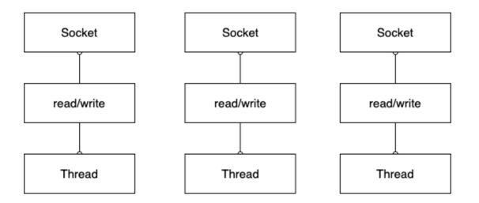<br>

위 사진처럼 I/O 작업마다 Thread 를 할당해서 사용해야 하므로, 많은 수의 Thread 가 소비된다 <br>

실제 많은 서버가 현재 Tcp connection 과 HTTP 요청부터 비즈니스 처리 후 응답까지 모두 Blocking 하게 처리 된다 <br>

많은 서버 프레임워크들은 이러한 비효율성을 Connection 풀 방식을 사용하여 비용을 줄였지만, 여전히 I/O는 모두 Blocking 하게 처리된다 <br>
그래서 Http 요청부터 비즈니스 처리 후 응답까지 모두 Blocking 하게 처리한다. (기본은 다 Blocking 방식이다) <br>

이 문제를 해결하는 방법은 I/O 작업을 Non-Blocking 하게 변경함으로써 적은 수의 Thread 로 여러개의 커넥션을 처리하도록 하는 것이다 <br>
- Blocking
  - 손님이 카운터에서 음식 시키고, 카운터 앞에서 음식 나올때 까지 기다림
  - 이때 식당 카운터 직원도 다른 손님 주믄 못 받고, 바로 앞 손님 음식 나오는거 전달해줘야해서 아무것도 못함
  - 그리고 이 짓을 반복한다..
- Non-Blocking
  - 손님이 카운터에 음식 시키고, 음식 나올 때 까지 화장실도 가고, 담배도 피러가고 한다 
  - 식당 카운터 직원은 계속 카운에서 손님을 음식을 주문 받는다
  - 그리고 주방으로 음식 주문들의 계속 요청한다. 

여기서 보면 손님:Client, 직원:Server 라는게 감이 올 것이다 <br>
딱보면 알겠지만 NIO 음식점이 훨씬 많은 수익을 낼 것이다 <br>

그러면 NIO 하게 처리하는 방식은 뭘까? <br>

## 이벤트 기반 프로그래밍 Non-Blocking Multiplexing I/O
앞서 Blocking 방식 보다 Non-Blocking 이 더 효율적이라고 했는데, 왜 그런걸까? 어떻게 동작하길래 그러지? <br>
그리고 적은 수의 Thread 로 여러 개의 커넥션을 어떻게 처리하는거지? 라는 궁금증이 생겼습니다 <br>

우선 커널 Network I/O 를 Non-blocking 하게 처리한다는 의미는 Thread 가 connect(), accept(), read(), write() 등 <br>
I/O 를 호출과 동시에 return 받아 막힘없이 계속 처리하는 것을 의미합니다 <br>

그리고 모든 I/O 를 막힘없이 바로 return 받는 Non-Blocking 의 처리방식은 크게 두 가지로 나뉜다 <br>
- Polling 방식
- Push 방식 -> Multiplexing I/O (Event)

#### Polling 방식
Polling 방식은 Push 방식에 비해서는 Bad-Practice 이다 <br>
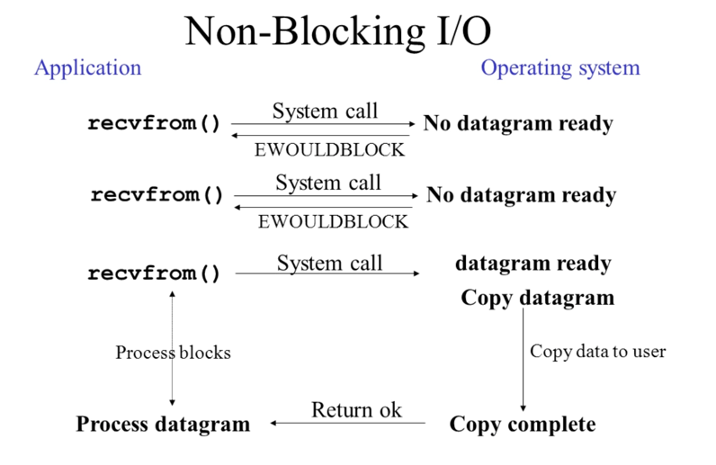 <br>

이 방식은 I/O 작업 요청은 막힘없이 바로 return 받는 NIO 로 동작한다 <br>
특정 Thread 가 지속적으로 모든 소켓을 반복하여 이전에 요청한 작업이 완료되었는지? 그리고 작업할게 있는지 체크하고 작업할게 있다면 작업을 수행하는 방식이다 <br>

이 방식도 NIO 방식이긴 한데, 특정 소켓에서 어떤 일이 발생했는지 계속 확인(Polling)해야 하기 때문에 <br>
kernel 에 I/O System Call(read/write) 을 지속적으로 호출하므로 cpu 가 계속 소모가 된다 <br>
추가적으로 폴링 작업을 하는 전용스레드 가 필요하기 때문에 스레드도 낭비가 된다.<br>
-> 소켓에서 이벤트가 발생하지 않아도, 폴링 스레드는 계속해서 폴링 작업을 하기 때문에 비용이 소모된다 <br>

또한 구현에 따라 확인하는 과정이 Blocking 되어 처리가 계속 지연되어 더 큰 문제가 발생할 수도 있게 된다 <br>
가장 큰 문제는 연결된 커넥션 수가 늘어나면 확인해야 할 Channel 이 많아지므로 성능이 점진적으로 나빠지게 된다 <br>

#### Multiplexing I/O
전통적으로 사용자 인터페이스가 포함된 프로그램에선 이벤트 기반 프로그래밍이 많이 사용된다 <br>

예를들어 마우스 클릭,키보드 입력에 반응하는 콜백이 이에 해당한다 <br>
각 이벤트를 먼저 정의해두고 발생한 이벤트에 따라서 콜백 코드가 실행되도록 프로그램을 작성하느 것이다 <br>

앞서 살펴본 Polling 방식은 직접 Channel 들을 순회하며 읽을 데이터가 있는지 체크했다 <br>
이보단 특정 Channel 이 변경되면 , 변경되었다고 이벤트를 만들어 알림을 주도록 설계하면 <br>
실제 이벤트가 일어났을 때만 컴퓨터가 일을 하면 되므로 리소스를 효율적으로 사용할 수 있게 된다 <br>

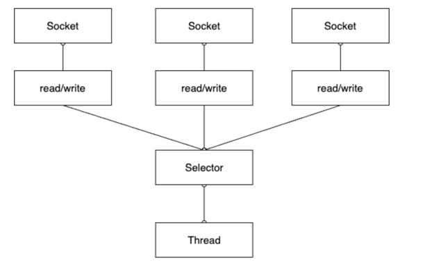 <br>

Selector 라는 이벤트 처리기를 가운데 두고 채널이 Selector 를 거쳐서 Thread 로 가게끔 하는 아키텍쳐 이다 <br>
이렇게 되면 이벤트가 발생했을 때만 컴퓨터가 일을 하면 되므로, 하나의 Thread 로 여러 개의 Channel 을 처리 및 관리할 수 있게 된다 <br>

그래서 이러한 I/O 방식을 Multiplexing 이라 부른다.

Multiplexing 은 단어 뜻대로 하면 다중화로 하나의 통로를 여러 개가 활용한다는 의미인데 <br>
이를 이벤트 기반의 소켓 통신에 적용하면 Selector(멀티플렉싱 역할) 을 하여, 하나의 객체가 여러 소켓 채널의 변화를 감지하여 이벤트 발생시에만 처리한다 <br>
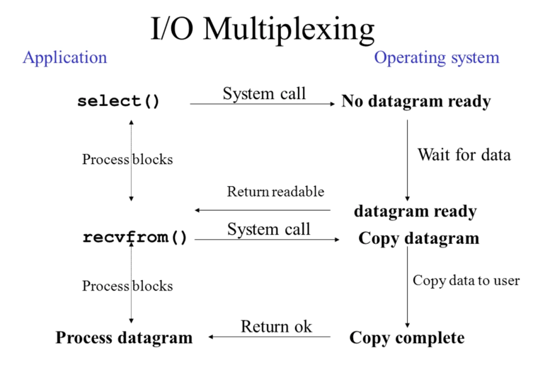 <br>

위 다이어그램을 보면 Application(서버) 가 os 커널에 System Call 요청을 하지 않고, 소켓에 변화가 있을 때 마다 os 커널이 Application 에 알려주는 방식이다 <br>

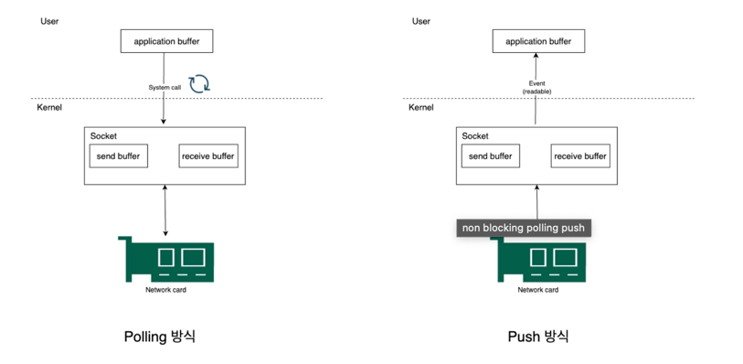 <br>

이렇게 os 커널에서 Socket Channel 내 변화가 있을 때 마다 이벤트 형식처럼 애플리케이션에 알려준다는 의미에서 개인적으로 이벤트 기반 프로그래밍과 유사한다고 생각든다 <br>

그리고 Netty 도 이러한 멀티플렉싱 을 활용한 EventLoop 기반으로 동작함으로써 높은 성능을 유지한다
> 어떻게 소켓에 변화가 있을 때마다 os 커널은 Application 에게 알림을 주는 것인가?

Linux 의 select(), poll(), epoll() 이 이벤트 알림 장치라고 생각하면 된다 <br>
- select(), poll() : 전체 조회를 하면서 이벤트가 있나 없나 체크
- epoll(): 이벤트 기반 프로그래밍이랑 제일 유사, 변화가 있으면 알림이 뜨게하는 로직
  - 구현이 어렵지만 제일 효율적이다


### Java NIO
Java 에서는 JDK1.3 까지는 OIO 만 지원하닥, JDK1.4 부터 NIO 라는 이름으로, Multiplexing I/O 를 지원하기 시작했다 <br>

앞서 봤던 이벤트 기반과 같이, Java NIO 의 Selector 에 SocketChannel 을 등록하면 해당 Socket 에서 <br>
변화(read/write) 가 발생했을 때 이벤트를 통해 처리를 할 수 있도록 지원한다. <br>
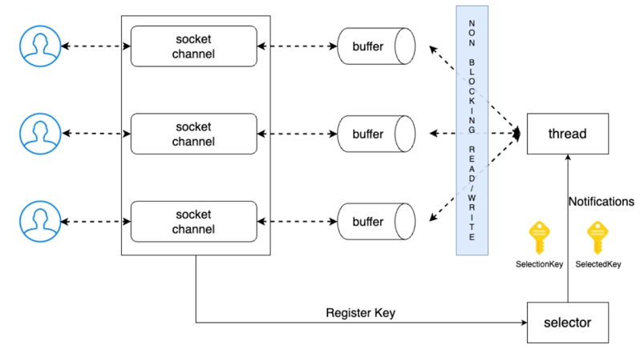<br>

위 그림에서 Selector 는 이벤트를 감지하는 역할을 하며, Non-blocking Channel 에 Selector 을 등록해두면 <br>
클라이언트의 요청이 오거나 read/write 작업이 필요한 경우 Channel 이 Selector 에 이벤트를 통보한다 <br>

그럼 Selector 는 미리 등록해둔 Key 상태를 변경하여 특정 Channel 에 대한 작업을 수행하도록 미리 등록된 콜백 메소드 실행 <br>
Thread 에 비즈니스 로직 처리를 위임한다 <br>

### ByteBuffer
Java I/O 느렸던 이유는 Blocking 방식으로 처리되는 문제도 있었지만, <br>
또 다른 이유는 JVM 어플리케이션이 커널 버퍼(Direct Buffer) 르 직접 핸들링 할 수 없기 때문이다 <br>

Socket 이나 file 로부터 Stream 이 들어오면 os 커널은 데이터를 커널 버퍼에 쓰게 된다 <br>
Java 에서 이 커널 버퍼에 접근할 수 있는 방법이 없다 <br>

따라서 처음엔 JVM 내부 메모리에 커널 버퍼 데이터를 복사해서 접근할 수 있도록 했으며, 이로인해 '커널에서 JVM 내부 메모리에 복사하는' 오버헤드가 발생한다 <br>
> JVM 내부 메모리는 프로세스 별로 할당되는 스택이나 힙 메모리를 의미함.

커널에 직접 접근할 수 있는 ByteBuffer - zero copy <br>
일단 os 커널에서 복사하는 비용을 줄여준다 <br>

ByteBuffer 는 Netty 에서 ByteBuf 으로 활용한다 <br>
ByteBuffer 를 사용하면 os 에서 zero copy 를 실현한다 <br>
다만 GC 의 영향권을 벗어나 자칫 메모리 누수가 발생할 수도 있어 상황에 따라 메모리 해제 관련해서 잘 챙겨줘야 한다 <br>

그리고 Java NIO 의 ByteBuffer 는 아래와 같은 문제점들이 존재한다 <br>
- 데이터 write/read 인덱스가 분리되어 있지 않아 하나의 값을 공유하여 사용한다.
  - write/read 모드가 없어, 하나의 pos 값을 flip 하여 사용한다.
- 버퍼의 사이즈가 고정적이다.
  - limit, capacity 를 넘어가면 버퍼의 사이즈가 늘어나느게 아닌 exception 이 발생한다.
- 버퍼 풀이 존재하지 않는다.
  - 버퍼풀이 없어서, 버퍼의 생성 및 해제 작업이 빈번하여 GC 가 자주 사용된다.

이러한 단점 때문에 ByteBuf 을 사용한다 <br>

ByteBuffer 는 JVM 내부 메모리에 기존대로 복사하는 방식과 커널에 직접 접근하는 DirectBuffer 방식이 있다 <br>
즉, 무조건 커널 내 메모리를 직접 접근하는 것이 아닌 구현 방식에 따라 다르므로 상황에 따라 알맞는 방식을 사용하는 것이 중요하다 <br>

### EventLoop
Multiplexing 기반으 NIO 와 ByteBuffer 를 사용하면 Reactor 패턴을 구현할 수 있다 <br>
그리고 Reactor 패턴은 우리가 보통 많이 이야기 하는 EventLoop 라고 볼 수 있다 <br>

그리고 Reactor 패턴은 우리가 보통 많이 이야기하는 EventLoop 라고 볼수 있다. <br>
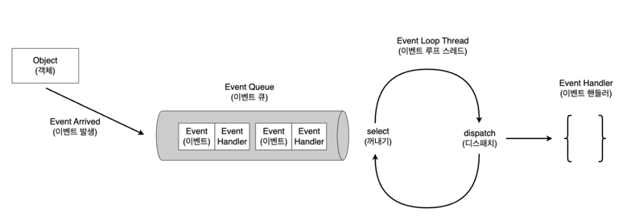 <br>

#### EventLoop
- 무한 반복문을 실행하며 Selector 로부터 I/O 이벤트가 발생할 때 까지 대기하다가 이벤트가 발생하면 해당 이벤트를 처리할 수 있는 Handler 에게 디스패치한다.
- 보통 특정 Channel 에 대한 이벤트를 큐에 삽입할 때, 해당 이벤트를 처리할 수 있는 Handler 도 같이 첨부해준다

#### Handler
- 이벤트를 받아 비즈니스 로직을 수행한다 (수행을 완료하고 결과에 맞는 이벤트를 다시 발행하기도 함)

정리하면 Client 와 Connection 을 통해 생성된 SocketChannel 을 EventLoop 에 등록하면<br> 
아래와 같이 해당 Channel I/O 부터 close 까지 생명 주기를 EventLoop 가 관리한다 <br>

즉 SocketChannel 을 EventLoop 에 등록함으로 써 Channel 의 제어 흐름, 멀티 스레딩, 동시성 제어 등을 EventLoop 가 대신 처리한다 <br>

Netty 는 실제로 위 EventLoop 개념을 적극 활용하여 EventLoop 구현체 중 하나인 NioEventLoop 를 사용하고 <br>
설계는 1 Selector + 1 thread + 1 taskQueue 로 되어있다 <br>

마지막으로 EventLoop 는 기본적으로 하나의 thread 에서 동작하기에 비즈니스 로직에 Blocking 한 로직을 넣으면 <br>
애플리케이션 성능이 더욱 악화될수 있다 <br>

Netty 는 동작 방식 과 원리를 잘 이해하고 사용해야 한다.

> 정리: EventLoop 는 Netty 에서 제어 흐름, 멀티 스레딩, 동시성 제어 등 역할 수행 (1 Thread 에서 작동함)

## Netty 동작 흐름 - EventLoopGroup 그리고 boss 와 child
#### Netty 의 기본적인 동작 방식 - EventLoop
Netty 는 기본적으로 EventLoop 기반으로 동작한다 <br>
더 자세히 이야기하자면 Netty 는 NIO Selector 에 등록된 Channel 에서 발생하는 이벤트들을 Channel 에 매핑된 핸들러가 처리하는 구조이다 <br>
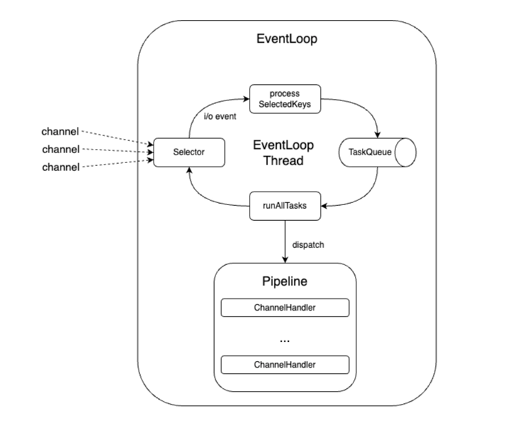 <br>

- EventLoop 라는 클 틀이 있음
- EventLoop Thread 가 존재하며 그 스레드가 여러 동작을 함
- 기존에 ServerChannel 들은 Selector 에 등록이 되어 있음.
- 만약 read/write 같은 이벤트가 발생하면 Selector 에 등록된 Key 를 TaskQueue 에 넣는다.
- TaskQueue 에서 dispatch 를 통해 Handler pipeline 에 위임하여 read/write 이벤트 로직을 처리한다.

pipeline 은 이벤트를 stream 으로 처리하는 파이프라인 정도로만 알고 있자 <br>

Pipeline = I/O 이벤트에 대한 Handler? <br>
많은 개발자들이 익순한 node.js & Redis 의 EventLoop 와 유사한 매커니즘을 가진다고 보면됨 <br>

#### Netty EventLoopGroup - BossGroup 와 ChildGroup
Netty 는 설정을 통해 여러 EventLoop 를 Group 로 묶을 수 있으며 Group 를 조합해서 애플리케이션을 구성한다 <br>
(Netty 의 가장 핵심적인 부분이기도 하다) <br>

쉽게 말해 같은 역할을 수행하는 복수의 EventLoop 를 EventLoopGroup 으로 묶을 수 있으며, <br>
EventLoopGroup 은 BossGroup, ChildGroup 으로 구분된다 <br>
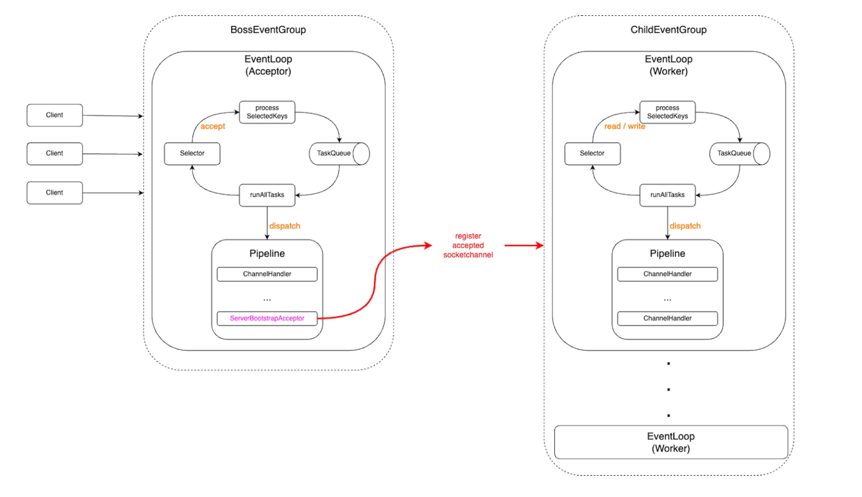 <br>

- BossGroup
  - Acceptor EventLoop Group 이라고 볼 수 있으며, 새로운 클라이언트의 연결 요청을 처리한다.
  - 즉 새로운 클라이언트와의 SocketChannel 을 생성하며, accept() 이벤트를 처리한다.
  - BossGroup 내 EventLoop 는 클라이언트와의 연결 부분만 처리하며, accept 완료된 SocketChannel 은 
  - childGroup 내 EventLoop Selector 에게 위임하여 데이터 read/write 는 ChildGroup 내 EventLoop 가 처리하도록 한다.
- ChildGroup
  - Worker EventLoop Group 으로도 많이 알려져있고(실질적인 이벤트 처리를 하는 EventLoop 이다)
  - BossGroup 으로부터 전달받아 Selector 에 등록된 SocketChannel 에서 발생하는 read/write 이벤트 처리한다.
  - 사용자 요청/응답에 대한 비즈니스 처리는 모두 ChildGroup 내 EventLoop 에서 처리함.

정리하면 Netty 는 다수의 EventLoop 를 두 개의 Group 으로 묶어서 사용하며, 아래와 같이 BossGroup 은 새로운 커넥션 처리 <br>
ChildGroup 은 연결된 커넥션에 대한 non-blocking 하게 read/write 를 처리한다고 보면된다 <br>
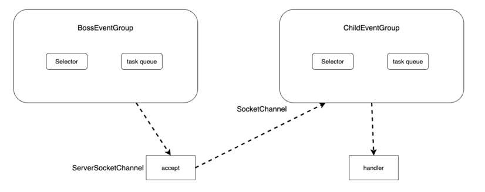 <br>

이렇게 구성된 구조상 SocketChannel 은 Worker EventLoop Group 내 하나의 EventLoop 에만 등록되어 처리된다 <br>
Boss 와 Child 를 구분한 이유는 새로운 연결에 대한 처리와 연결된 커넥션에 대한 처리를 분리함으로써 더 많은 트래픽을 동시에 소화할 수 있도록 한다 <br>

당연히 새로운 소켓 연결보단 채널에 대한 이벤트 read/write 가 더 많이 발생할 것이다 <br>
그래서 보통 Worker EventLoop(=ChildEventLoop) 수 를 더 많이 설정한다 <br>

그래서 Netty 는 따로 설정하지 않으면 디폴트로 Worker Group 의 EventLoop 의 수를 **2 * 사용 가능한 프로세서 수** 로 설정한다. <br>

물론 위 구조가 절대적인 것은 아니다, 예를 들어 Netty Server 가 아닌 Netty Client 를 사용할 경우 <br>
새로운 연결을 한번만 하면 되기 때문에 보통 하나의 EventLoopGroup 으로 I/O 이벤트를 모두 처리한다 <br>

## Netty 구성요소
Netty 는 실제 클라이언트-서버 간의 네트워크 통신과정에서 여러 컴포넌트들이 각자의 역할을 수행하며 협력한다.<br>
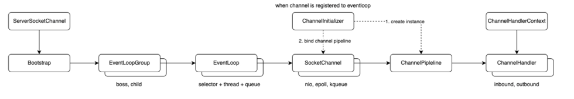<br>

비교적 많은 컴포넌트들이 서로 각자의 역할을 수행하며, 다른 컴포넌트와 상호 협력한다 <br>
1) ServerSocketChannel 이 클라이언트 연결
2) BootStrap
3) EventLoopGroup (Boss,Child) Boss - 연결 처리, Child - 실제 이벤트 처리
4) EventLoop (selector, thread, queue)
5) SocketChannel 클라이언트 연결 유지, 데이터 송수신
6) ChannelPipeline
7) ChannelHandler

### Channel
NIO 에서는 그냥 채널이 아닌 SocketChannel 을 사용한다 <br>

Channel - 네트워크 소켓 I/O 에 대한 실질적인 처리를 수행한다 <br>
Channel 은 TCP 커넥션에 대한 I/O 작업을 처리하는 역할을 수행한다 <br>
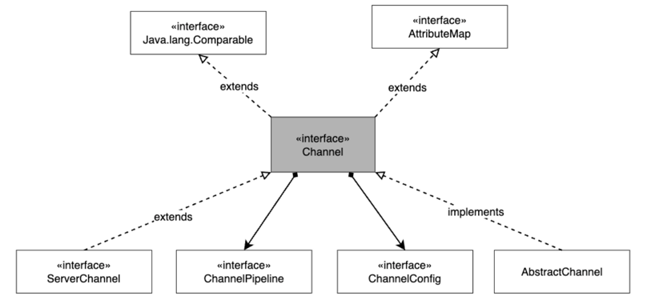<br>

구체적으로 Channel 은 사용자에게 아래와 같은 기능을 제공합니다 <br>
- Channel 의 현재 상태 ( open? connect? close?)
- Channel 에 대한 설정 ( send/receive buffer size)
- I/O 명령 (read,write,connect,bind) 
- Channel 에 대한 I/O 이벤트 처리할 ChannelPipeline 관련 처리
- 연결된 EventLoop 조회 (Channel 이 등록된 EventLoop 를 알 수 있다)

그리고 필요에 따라 ChannelPipeline 에 ChannelHandler 를 추가 및 제거하여 Channel I/O 이벤트에 대한 처리를 수행한다<br>

ChannelPipeline 이나 ChannelConfig 이외에도 Channel 에 정의된 다양한 역할을 수행한다 <br>
+ eventLoop() : channel 이 등록된 EventLoop 를 반환한다.
+ pipeline() : channel 에 등록된 ChannelPipeline 을 반환한다.
+ isActive() : Channel 이 active 한 상태인지 boolean 으로 반환한다
+ localAddress() : 바인딩된 Local 의 SocketAddress 를 반환한다.
+ remoteAddress() : 원격의 SocketAddress 를 반환한다.
+ write() : 원격에 데이터를 write, 데이터는 ChannelPipeline 을 통과하여 새로 고쳐질 때 까지 대기열 보관
+ flush() : write 을 통해 예약된 모든 write 작업을 flush 한다, 즉 이전에 write 된 데이터를 모두 전송 계층 소켓에 flush 한다. (버퍼를 보낸다)(버퍼를 비운다)
  + 즉 write 에 저장된 값을 출력함과 동시에 비워준다. write 에 저장된 값은 메모리에 저장되어 있다? ByteBuffer 에 저장되어 있다? 
+ writeAndFlush() : write 호출 후 flush 호출

보통 writeAndFlush 를 통해 데이터를 원격지에 전송한다.
```java
		// 연결된 Channel
		Channel channel = ...;

		// Channel 을 통ㄹ해 원격지에 데이터를 보낼 때 사용될 ByteBuf
		ByteBuf buf = Unpooled.copiedBuffer("Hello World", CharsetUtil.UTF_8);

		// channel 에 BYteBuf 를 넘기고 write 과 flush 한다.
		ChannelFuture ch = channel.writeAndFlush(buf);

		// Channel 에 I/O 명령인 writeAndFlush 명령에 대한 결과 콜백 추가
		ch.addListener(new ChannelFutureListener() {

			@Override
			public void operationComplete (ChannelFuture future) throws Exception {
				if(future.isSuccess()){
					log.info("Write Successful");
					return;
				}
				log.error("Write Error");
				future.cause().printStackTrace();
			}
		});
```

위 코드를 보면 실질적인 Network Socket(TCP 연결) 에 대한 I/O 요청과 처리는 모두 Channel 을 통해서 수행한다 <br>

> Channel 은 이러한 I/O 요청을 받으면 미리 설정된 Pipeline 내 Inbound/Outbound Handler 를 수행하고 I/O 작업을 수행한다.

### Unsafe interface
Channel 과 더불어 꼭 알아야하는 인터페이스가 있어 따로 소개하고자 한다. <br>
Channel 인터페이스를 보면 내부 클래스로 Unsafe 인터페이스가 정의되어 있다 <br>

이 Unsafe 란 용어는 Netty 뿐만 아니라 자바 내에서도 많이 사용되는 용어이며, 보통 C나 커널 명령에 부합하는 low-level 명령을 호출할 때의 인터페이스 역할을 한다 <br>
Netty 에서의 Unsafe 도 커널내 Socket I/O 작업을 모두 수행하며, Channel 내 I/O 작업이 필요하면 모두 이 Unsafe 의 구현체에게 위임한다 <br>

즉, Netty 의 ChannelPipeline 내 모든 I/O 작업은 결국 Unsafe 인터페이스 구현체에 의해 실행된다 <br>

> 보통 유저 레벨의 코드에선 unsafe 한 명령에 속하는 read,write 의 I/O 명령을 직접 호출할 일이 거의 없다.
> > 공식 문서에도 가능한 Unsafe 인터페이스의 구현체를 사용하길 추천하고 있다.

#### Unsafe 구현체 - Byte, Message
실제 Unsafe 인터페이스의 구현체는 Channel 의 구현체 별로 다 있다. <br>
즉 NIO, epoll, queue 등의 Channel 구현체 마다 모두 Unsafe 구현체를 구현 및 가지고 있다 <br>

NIO 기준으로 살펴보면 다음과 같은 계층 구조를 가진다 <br>
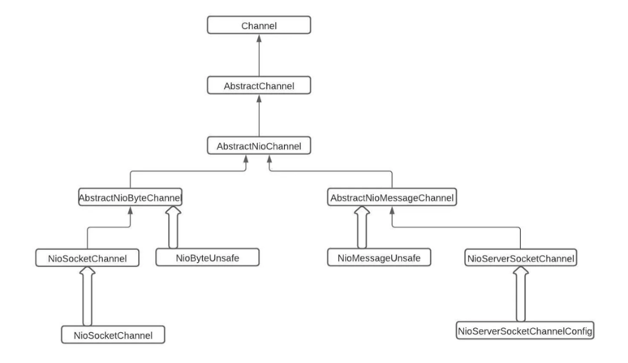 <br>

Unsafe 의 Nio 버전 하위 인터페이스로 NioUnsafe 가 정의되어 있다. <br>
그리고 위 인터페이스는 크게 Byte, Message 이름이 붙은 구현체로 나뉜다 <br>

- NioByteUnsafe 와 NioSocketChannelUnsafe(클라이언트 NioSocketChannel 의 구현체) 는 데이터 write 와 read 등의 I/O 작업을 수행한다.
- NioMessageUnsafe 의 구현체들은 새로운 커넥션을 수립하는 작업을 수행한다.

정리하면, Unsafe 인터페이스의 구현체는 NioByteUnsafe 와 NioMessageUnsafe 라는 두 가지 유형으로 나뉘며, <br>
Byte 는 읽기-쓰기 작업과 관련이 있고, Message 는 새 연결 설정 작업과 관련이 있다.<br>

unsafe 가 많이 보일 것이다. 이건 Socket I/O 작업을 수행하는 것이라고 생각하고 보면 더욱 이해하기 쉽다 <br>

### ChannelFuture & ChannelPromise
> 비동기 결과 알림 

#### Channel I/O 에 대한 비동기 처리 pending completion 결과 - ChannelFuture
Netty 에서의 모든 I/O 작업은 비동기로 동작한다. 즉 I/O 작업 호출시 호출되자마자 바로 return 된다 <br>

이때 모든 I/O 작업 요청의 결과로 void 를 return 하는 것이 아닌 ChannelFuture 를 반환하게 된다. <br>

ChannelFuture 은 이름에서 알 수 있듯이 Java 의 비동기 API 인 Future 와 유사한 역할을 수행한다<br>
물론 Future 보다 Callback 이 추가된 CompletableFuture 와 더 유사하다 <br>

쉽게 말해 CompletableFuture 처럼 비동기 작업을 요청하고 콜백을 넣어 비동기+NIO 하게 동작할 수 있게하는 것이며 <br>
ChannelFuture 는 Channel I/O 작업에 더 특화되어 비동기 + Non-blocking 으로 동작할 수 있게 도와준다 <br>

ChannelFuture 를 통하면 비동기 요청한 처리가 완료되었는지 I/O 상태를 확인할 수 있다 <br>

ChannelFuture 공식 문서에도 Blocking 되는 명령어인 await() 대신 NIO 형식인 addListener() 를 추천한다.

#### wrtie 작업에 더 특화된 ChannelFuture - ChannelPromise
Channel write 에 대한 처리를 수행하는 Handler 인 ChannelOutboundHandler 의 대부분의 메소드는 작업 완료 <br>
시 알림을 받기 위해 ChannelPromise 를 파라미터로 받는다. <br>

ChannelPromise 는 ChannelFuture 의 하위 인터페이스로써 setSuccess() 또는 setFailure() 와 같이 <br>
write 가능한 메소드를 정의하여 ChannelFuture 를 불변으로 만들어준다 <br>

### ChannelHandler & ChannelPipeline
Netty 컴포넌트 중 가장 핵심이 되는 것은 개발자의 비즈니스가 담기는 ChannelHandler 이다 <br>
아래 Deep Dive 에서 이와 관련해서 더 자세히 다루겠지만, 여기선 우선 어떤 역할을 수행하는지만 간단히 정리해본다 <br>

#### ✅ChannelPipeline = ChannelHandler 의 조합
Netty 의 가장 핵심이자 기본이 되는 개념인 Channel 이 TCP 연결후 생성되고 나면 ChannelPipeline 을 Channel 에 구성하게 된다 <br>
Netty 는 기본적으로 데이터를 받기 위한 InputStream 을 Inbound, 데이터를 내보내기 위한 Output Stream 을 Outbound 라고 표현한다 <br>

그리고 ChannelPipeline 은 여러 ChannelHandler 의 조합을 의미하며 <br>
ChannelHandler 는 Channel 에 대한 실질적인 read/write 를 호출하고, 비즈니스를 수행하는 컴포넌트 이다 <br>

EventLoop 안에 Selector 에 등록된 Channel 에서 I/O 가 이벤트 발생시 ChannelHandler 가 이 이벤트에 대한 처리를 수행한다 <br>

#### ✅Netty 내 Channel 은 각각 별도로 고유한 ChannelPipeline 이 존재한다.
ChannelHandler 는 인터셉팅 필터 패턴을 구현하고 있다 <br>
그러므로 개발자가 Handler 를 자유롭게 추가 및 삭제할 수 있다 <br>

이는 여러 Handler 를 서로 상호작용할 수 있도록 제어할 수 있다는 의미이며, <br>
각 Channel 엔 여러 Handler 의 조합을 나타내는 고유한 ChannelPipeline 을 가진다 <br>

중요한 점은 새로운 Channel 이 TCP 연결 후 생성되고 나면 Netty 는 자동으로 ChannelPipeline 도 생성하여 Channel 에 매핑한다는 점이다 <br>
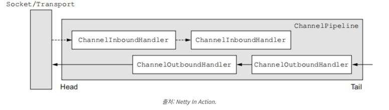<br>

##### ChannelHandler 엔 Blocking 코드 사용을 금지시키는 것이 좋다.
✅EventLoop 내 스레드를 Blocking 하게되면 성능에 부정적인 영향을 끼친다. <br>
ChannelPipeline 에 각 ChannelHandler 는 EventLoop 에서 발생한 I/O 이벤트를 전달받아 처리하게 된다 <br>
EventLoop 는 Single Thread 기반으로 동작하기 때문에 해당 스레드를 Blocking 하지 않는게 굉장히 중요하다 <br>

만약 Blocking 하게되면 해당 EventLoop 에 등록된 Channel 이벤트 처리에 아주 큰 부정적인 영향을 끼치게 된다. 

이로인해 ChannelHandler 비즈니스 로직은 무조건 NIO 하게 처리하는게 좋다 <br>
> 더 정확히 말하자면 EventLoop 안에 Selector Thread 를 Blocking 하면 안된다 
> > DB 접근, 비즈니스 처리는 다른 스레드를 활용하고 Selector Thread 는 정말 비즈니스가 완료된 내용에 대한 I/O 작업만 처리하다록 하는 것이 좋다.

실제 I/O 에 해당하는 read 나 write 는 모두 ChannelFuture 를 반환하는 등 NIO 하게 동작할 수 있게 기반이 마련되어있다 <br>

그러면 NIO 하게 처리하기 위해선 어떻게 해야할까? <br>
바로 비동기와 Callback 을 활용하는 것이다 <br>

즉 비즈니스 처리를 다른 Thread 로 비동기 요청하고, ChannelFuture, CompletableFuture 등을 반환받아 처리가 완료되면 <br>
callbacks 으로 Channel 에 처리 완료된 내용을 I/O 부분만 Netty EventLoop 에 위임하는 것이다 <br>

### ChannelHandler
ChannelHandler 는 ChannelPipeline 안에서 조합을 통해 실행된다 <br>
ChannelHandler 는 매핑된 Channel 이 등록된 EventLoop 에서 발생한 I/O Event 와 I/O Operation 을 <br>
처리하거나 파이프라인 내에서 다음 핸들러를 실행하는 역할을 한다. <br>

그리고 Inbound 와 Outbound 로 구분되어 사용한다 <br>
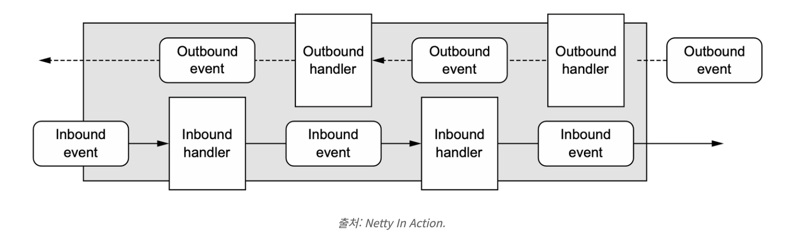 <br>

- ChannelInboundHandler : Inbound I/O **Event** 를 처리하는 Handler
- ChannelOutboundHandler : Outbound I/O **Operation** 을 처리하는 Handler

#### ChannelInboundHandler
ChannelInboundHandler 는 쉽게 생각하면 원격 장치에서 요청한 connect 와 read 에 대한 이벤트에 대한 콜백을 수행하는 ChannelHandler 이다
- channelRead() : Channel 로부터 데이터를 read 할 때 호출된다.
- channelRegistered() : Channel 이 EventLoop 에 등록되어 I/O 작업을 수행할 준비가 되었을 대 호출

생명 주기에 따라 다양한 콜백을 지원하는 것을 볼 수 있으며, 실제 Netty 작업시 흔히 접하게 될 것이다 <br>
channelRead() 보통 개발자 코드가 많이 들어가게 되는데, polling 된 ByteBuf 의 인스턴스의 경우 명시적으로 메모리를 해제 해줘야 한다 <br>

보통 메모리 해제는 네티에서 제공하는 ReferenceCountUtil.release() 를 사용한다 <br>

#### ChannelOutboundHandler
ChannelOutboundHandler 는 Outbound I/O Event 를 handle 하는 Handler 이다 <br>
쉽게 생각하면 원격 장치에 보낼 연결 요청 (connect), write 이벤트에 대한 콜백을 수행하는 ChannelHandler 이다.
- bind() : Channel 을 Local 에 bind 요청할 떄 호출된다.
- connect() : 원격 장치에 connect 요청시 호출
- read() : Channel 로 부터 많은 데이터를 가져오는 요청
- write() : Channel 을 통해 원격 장치에 보내는 전송

Netty 는 기본적으로 NIO 로 동작하기 때문에 ChannelOutboundHandler 대부분 메소드는 <br>
호출시 작업 완료 알림을 받기 위한 ChannelPromise 를 파라미터로 받음 <br>

#### ChannelHandlerAdaptor
ChannelInboundHandler, ChannelOutboundHandler 모두 순수 인터페이스라서 모든 메소드를 구현해줘야 한다 <br>
Netty 는 편의를 위해 ChannelHandlerAdaptor 추상 클래스를 구현한 어댑터 클래스를 제공한다 <br>
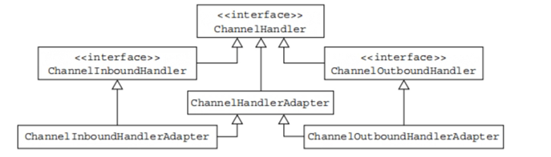<br>

- ChannelInboundHandlerAdaptor: Inbound I/O Event 어댑터 구현체 이다.
- ChannelOutboundHandlerAdaptor: Outbound I/O Operation 어댑터 구현체 이다.
- ChannelDuplexHandler: Inbound, Outbound Event 처리용 어댑터 구현체 이다.


### ChannelHandlerContext
Handler 간의 상호작용을 도와주는 객체이다 <br>

ChannelPipeline 내 ChannelHandler 는 서로 상호작용할 때 ChannelHandlerContext 객체를 활용한다 <br>
ChannelHandlerContext 는 보통 ChannelPipeline 생성되면서 같이 생성된다 <br>
ChannelHandlerContext 객체를 통해 Handler 들은 upstream, downstream 으로 이벤트를 전달할 수도 있고 <br>
Pipeline 을 동적으로 변경시킬수도 있으며, Key:value 형태의 정보를 저장할 수도 있다 <br>

ChannelHandlerContext 의 대표적인 기능 중 하나가 Handler 간의 이벤트 전파 이다 <br>
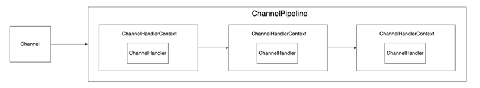<br>
위 그림은 실제 ChannelPipeline 과 ChannelHandler, ChannelHandlerContext 가 어떤 관계를 가지는지 보여준다 <br>
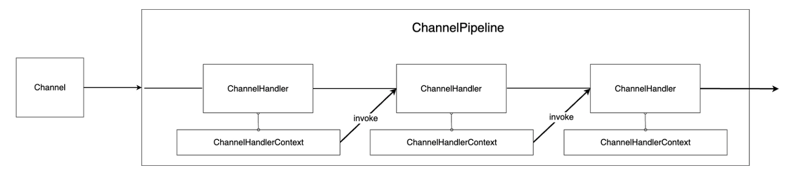<br>
실제 이벤트 전파를 위한 실질적인 실행(invoke) 는 ChannelHandlerContext 가 수행한다 <br>

ChannelHandlerContext 는 네이밍에서 알 수 있 듯이, 파이프라인내 현재 Handler 실행 컨텍스트를 저장하고 처리하는 역할을 수행한다 <br>
쉽게 말해 다음 이벤트를 처리할 Handler 를 찾아 Handler 에 실행을 위임하고, 현재 스레드가 어느것이냐에 따라 바로 실행하거나 TaskQueue 에 넣는 등등 처리 수행 <br>
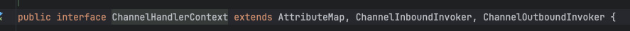<br>
inbound, outbound 둘 다 각각의 전파 메소드를 가지고 있다 <br>

ChannelHandlerContext 메소드 실행을 하면 이제 다음 Handler 로 메시지를 전파한다 <br>

ChannelHandlerContext - 상태관리 <br>
보통 Channel 당 하나의 ChannelPipeline 을 생성하여 매핑 후 이벤트를 처리한다 <br>
다만 로그인과 같이 특정 ChannelHandler 가 여러 Channel 에서 공유되어야 하며, ChannelHandler 내 간단하게 멤버 변수로 로그인 여부 등<br>
상태를 관리해야 하는 경우 ChannelHandlerContext 를 이용할 수 있다 <br>

### ChannelInitializer
새로운 연결이 수립될 때 마다 SocketChannel 이 생성되며, Channel 마다 ChannelPipeline 이 생성 및 매핑되어 이벤트를 처리한다고 했다<br>
이렇게 Channel 이 생성되었을 때 ChannelPipeline 을 생성, 초기화 및 매핑해주는 역할을 수행하는 컴포넌트가 바로 ChannelInitializer 이다<br>
```java
public class ChannelInitializerEx extends ChannelInitializer<SocketChannel> {
	@Override
	protected void initChannel (SocketChannel ch) throws Exception {
		ChannelPipeline pipeline = ch.pipeline();
		pipeline.addLast(new EchoServerHandler());
	}

}

```

- 새로운 연결이 accept 되어 채널이 생성될 때 마다 호출된다.
- 채널 파이프라인을 가져온다.
- 채널에서 Read/Write 이벤트 발생시 마다 처리할 Handler 들을 ChannelPipeline 에 초기화한다.


### BootStrap


https://mark-kim.blog/netty_deepdive_1/ 


### 용어 정리
- ChannelPromise: 이벤트 알림을 받기 위한 클래스
- ChannelHandler: 데이터 처리, 이벤트 처리를 하는 것 ex) 아파트 경비아저씨 느낌? 청소하고,분리수거하고 이런 등등? 느낌
- ChannelPipeline: ex) ChannelHandler 를 순서대로 연결하는 구조이다 ex) 아파트 복도, 방문객은 아파트 복도를 거쳐야 한다. 
- ServerSocketChannel - (서버라고 생각) 서버 소켓 생성 및 다중 클라이언트 연결 처리 추상 클래스 ex) 아파트 앞에 있는 경비원 분이 방문객 확인하고 입장 허가 하는 느낌
- SocketChannel - 네트워크 연결 구축(클라이언트와 연결 유지), 데이터 송수신 ex) 방문객이 아파트에 들어가는 것, 거주자가 다른 거주자와 편지를 주고받는 느낌?
- kernel: 컴퓨터의 핵심 제어 시스템
- dispatch: 다음으로 실행될 프로세스에게 cpu 를 할당한다.
- read: 데이터를 가쟈와 메모리에 저장하는 것 ex) 책 읽고 머릿속에 기억하는 것과 비슷
- write: 메모리에 있는 데이터를 저장 장치에 전송하고 저장 ex) 머리 속에 있는 기억을 글로 적는 것과 비슷
- System Call: 내가 원하는 프로그램 또는 파일을 찾아 사용자에게 제공하는 것.
- 데이터 스트림 - 데이터가 연속적으로 흐르는 방식
- 버퍼: 데이터를 일시적으로 저장하는 공간
- DMA: cpu 가 직접 개입하지 않고도 ram 과 입출력 장치간에 데이터를 전송하는 방식
- 오버헤드: 어떤 처리를 하기 위해 들어가는 간접적인 처리 시간 · 메모리
- Idle Thread: 현재 작업을 수행하거나 이벤트를 기다리지 않는 스레드.
- 커널 버퍼: os 내부에서 데이터를 저장하고 가져오는데 사용되는 임시 저장 공간이다.
- recvfrom() : 연결된 소켓과 연결되지 않은 소켓 모두에서 들어오는 데이터를 읽고 데이터가 전송된 주소를 캡처함.


