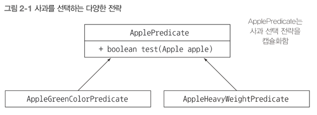

## 동작 파라미터 화 코드 전달하기

### 목차
- 변화하는 요구사항에 대응
- 동작 파라미터화
- 익명 클래스
- 람다 표현식 미리보기
- 실전 예제 : Comparator, Runnable, GUI

동적 파라미터화 를 이용하면 자주 바뀌는 요구사항에 효과적으로 대응할 수 있다. <br>
동작 파라미터화란 아직은 어떻게 실행할 것인지 결정하지 않은 코드 블록을 의미한다. <br>
이 코드 블록은 나중에 프로그램에서 호출한다. 즉 코드 블록의 실행은 나중으로 미뤄진다 <br>

### 변화하는 요구사항에 대응하기
1) 첫 번째 시도 : 녹색 사과 필터링
```java
Enum color {
	RED, GREEN
    }
	
	
public static List<Apple> filterGreenApples(List<Apple> inventory) {
	var result = new ArrayList<Apple>(); // 사과 리스트
	for (Apple apple : inventory) {
		if (GREEN.equals(apple.getColor())) { // 녹색 사과만 선택
			result.add(apple);
		}
	}
	return result;
}
```

이렇게 코드를 작성하면, 녹색 사과만 필터링을 할 수 있다. 그러나 나중에 빨간 사과도 필터링을 해야한다면? <br>
그러면 저 코드를 빨강으로해서 2번 작성해야할까? 아니면 조건문을 2번줘야할까? <br>
나중엔 색깔 별로 필터링을 하고싶다면? 모든 색깔을 필터링하는 메소드 여러개를 만들어야할까? 아닙니다 <br>

거의 비슷한 코드가 반복 존재한다면, 그 코드를 추상화 해야 합니다. <br>

2) 두 번째 시도 : 색을 파라미터화 
같은 메소드를 반복하지 않고, 어떻게 구현할 수 있을까? 바로 파라미터화 하여 메서드에 추가하는 것이다.<br>

```java
import java.util.ArrayList;

public static List<Apple> filterApplesByColor (List<Apple> inventory, Color color) {
	List<Apple> result = new ArrayList<>();
	for (Apple apple : inventory) {
		if ( apple.getColor().equals(color)) {
			result.add(apple);
		}
	}
	return result;
}
```

이렇게 파라미터로 객체를 받으면, 좀 더 유연한 코드가 될 수 있다. <br>
나중에 객체를 받을 때 
```java
List<Apple> greenApples = filterApplesByColor(inventory, GREEN);
List<Apple> greenApples = filterApplesByColor(inventory, RED);
```
이런식으로 원하는 값만 추출을 할 수 있습니다 <br>

갑자기 추가적인 요구사항이 발생했습니다. 색 을 필터링말고 무게도 필터링을 하고싶다네요? <br>
그럼 어떻게 해야할까요? <br>
방금 처럼 파라미터로 무게를 받아서 필터링을 하는 것 입니다. 
```java
public static List<Apple> filterApplesByWeight(List<Apple> inventory, int weight) {
	List<Apple> result = new ArrayList<>();
	for (Apple apple : inventory) {
		if ( apple.getWeight() > weight ) {
			result.add(apple);
		}
	}
	return result;
}
```

위 코드도 좋은 해결책일 수 있습니다. 하지만 구현 코드를 자세히 보면 목록을 검색하고, 각 사과에 필터링 조건을 적용하는 부분의 코드가 색 필터링 코드와 대부분 중복이 됩니다. <br>
탐색 과정을 고쳐서 성능을 개선하려면 무슨 일이 일어날까? <br>
한 줄이 아니라 메서드 전체 구현을 고쳐야 한다. 즉 엔지니어링 적으로 비싼 대가가 있다. <br>

3) 세 번째 시도 
별로 좋지 않은 코드긴 한데 설명한 코드 입니다.
```java
public static List<Apple> filterApples(List<Apple> inventory, int weight, Color color, boolean flag) {
	List<Apple> result = new ArrayList<>();
	for (Apple apple : inventory) {
		if ( (flag && apple.getColor().equals(color)) || (!flag && apple.getWeight() > weight)) {
			result.add(apple);
		}
	}
	return result;
}
```

위 메서드는 파라미터가 무려 4개나 된다. 정말 좋지 않은 코드 이다 <br>
위 코드를 고치기 위해서는 <b>동적 파라미터화</b> 를 이용해 볼 것이다. <br>
사과의 어떤 속성에 기초해서 Boolean 값을 반환 하는 방법이 있다. 참 또는 거짓을 반환하는 Predicate<> 함수를 정의하자
```java
public interface ApplePredicate {
	boolean test (Apple apple);
}
```

그리고 정의한 인터페이스를 구현한다.
```java
// 무거운 사과만 선택
public class AppleHeavyWeightPredicate implements ApplePredicate {
	@Override
	public boolean test(Apple apple) {
		return apple.getWeight() > 150;
    }
}

// 녹색 사과만 선택
public class AppleGreenColorPredicate implements ApplePredicate {
	@Override
	public boolean test(Apple apple) {
		return GREEN.equals(apple.getColor());
	}
}
```

<br>
위 조건에 따라 filter 메소드가 다르게 동작할 것 이라고 예상을 할 수 있습니다. <br>
위 패턴을 <b>전략 디자인 패턴 </b> 이라고 합니다 <br>
전략 패턴은 각 알고리즘을 캠슐화하는 기법 이라고 생각하면 된다 <br>
위 처럼 동작 파라미터화, 즉 메소드가 다양한 동작 을 받아서 내부적으로 다양한 동작을 수행하게 끔 하는 것이다 <br>
이제 filterApples 메소드를 ApplePredicate 객체를 파라미터로 받로고 고쳐보자, 이렇게 하면 <br>
filterApples 내부에서 컬렉션을 반복하는 로직과 컬렉션의 각 요소에 적용할 동작을 분리할 수 있다. 

4) 네 번째 시도 : 추상적 조건으로 필터링

```java
public static List<Apple> filterApples (List<Apple> inventory, ApplePredicate p) {
	List<Apple> result = new ArrayList<>();
	for (Apple apple : inventory) {
		if (p.test(apple)) {
			result.add(apple);
		}
	}
	return result;
}
```

#### 코드 동작 전달하기

#### 한 개의 파라미터, 다양한 동작
컬렉션 탐색 로직과 각 항목에 적용할 동작을 분리할 수 있다는 것이 <b>동작 파라미터화</b> 의 강점이다. <br>

### 쿠즈 2-1 유연한 prettyPrintApple 메서드 구현하기
```java
public interface AppleFormatter {
	public String accept(Apple apple);
}

public class AppleFancyFormatter implements AppleFormatter {
	@Override
    public String accept(Apple apple) {
		String chr = apple.getWeight() > 150 ? "heavy":"lignt";
		return "A" + chr + " " + apple.getColor() + " apple";
    }
}

public static void prettyPrintApple(List<Apple> inventory, AppleFormatter appleFormatter) {
	for (Apple apple : inventory) {
		String output = appleFormatter.accept(apple);
		System.out.println(output);
	}
}
```


