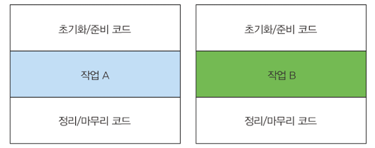

# 람다 표현식

### 목차
- 람다란 무엇인가?
- 어디에, 어떻게 람다를 사용하는가?
- 실행 어라운드 패턴
- 함수형 인터페이스, 형식 추론
- 메소드 참조
- 람다 만들기

동작 파라미터화를 이용해서 변화하는 요구사항에 효과적으로 대응하는 코드를 구현할 수 있다<br>
또한 정의한 코드 블록을 다른 메소드로 전달할 수 있다.<br>
즉 동작파라미터화를 이용하면 더 유연하고 재사용할 수 있는 코드를 만들 수 있다.<br>

익명클래스로 다양한 동작을 구현할 수 있지만 만족할 만큼 코드가 깔끔하지는 않았다. <br>
깔끔하지 않은 코드는 동작 파라미터를 실전에 적용하는 것을 막는 요소다.<br>

## 람다란 무엇인가?
<b>람다 표현식</b> 은 메소드로 전달할 수 있는 익명 함수를 단순화한 것이라고 할 수 있다.<br>
람다 표현식에는 이름은 없지만, 파라미터 리스트, 바디, 반환형식, 발생할 수 있는 예외 리스트는 가질 수 있다.
- 익명 => 메소드와 달리 이름이 없어서 익명이라 함
- 함수 => 클래스에 종속되지 않음.
- 전달 => 메소드 인수로 전달하거나 변수로 저장할 수 있다.
- 간결성 => 익명클래스 처럼 자질구레한 코드를 구현할 필요가 없다.

람다의 편의성을 보여주는 코드이다.

```java
import java.util.Comparator;// 기존코드
Comparator<Apple> byWeight = new Comparator<Apple>() {
	@Override
	public int compare (Apple o1, Apple o2) {
		return o1.getWeight().compareTo(a2.getWeight());
	}
};

// 람다
Comparator<Apple> byWeight = (Apple a1, Apple a2) -> a1.getWeight().compareTo(a2.getWeight());
```

코드가 훨씬 간단해졌다. 사과 두개의 무게를 비교하는데 필요한 코드가 훨씬 간단해졌다.

```java
(Apple a1, Apple a2) -> a1.getWeight().comapreTo(a2.getWeight());
//  [람다 파라미터]   [화살표]  [              람다 바디              ]       
```

- 파라미터 리스트 : Comparator 의 compare 메소드의 파라미터(사과 두개)
- 화살표 : 람다의 파라미터 리스트와 람다 바디를 구분한다.
- 람다 바디 : 두 사과의 무게를 비교하며, 람다의 반환 값에 해당하는 표현식이다.

```java
// 람다 표현식 예제
(String s) -> s.length();

(Apple a) -> a.getWeight() > 150;

(int x, int y) -> {
	System.out.println("Result : ");
	System.out.println("x+y);
    }

	() -> 42
```

람다의 기본적인 문법은 <br>
1) (parameters) -> expression <br>
2) (parameters) -> { statements; } <br>

람다 예제
```java
// 불리언 표현식
(List<String> list) -> list.isEmpty();

// 객체 생성 
() -> new Apple(10)

// 객체에서 소비
(Apple a) -> {
	    System.out.println(a.getWeight());
    }
	
// 객체에서 선택/추출
	(String s) -> s.length()

// 두 값을 조합
(int a, int b) -> a*b

// 두 객체 비교
(Apple a1, Apple a2) -> a1.getWeight().compareTo(a2.getWeight())
```

### 어디에, 어떻게 람다를 사용할까?
함수형 인터페이스 라는 문맥에서 람다 표현식을 사용할 수 있다. <br>
위 예제에서는 함수형 인터페이스 Predicate<T> 를 기대하는 filter 메소드의 두 번째 인수로 람다 표현식을 전달했다<br>

### 함수형 인터페이스
2장에서 만든 Predicate<T> 가 함수형 인터페이스 이다. Predicate<T>는 오직 하나의 추상 메소드만 저장하기 때문이다.
```java
public interface Predicate<T> {
	boolean test(T t);
}
```

함수형 인터페이스는 정확히 하나의 추상 메소드를 지정하는 인터페이스 이다<br>
```java
public interface Comparator<T> {
	int compare(T o1, T o2);
}

public interface Runnable {
	void run();
}
```
               
등등 여러 함수형 인터페이스들이 있다<br> 
즉 추상 메소드가 오직 하나이면 함수형 인터페이스이다<br>
또는 @FunctionalInterface 위 어노테이션이 있으면 함수형 인터페이스 이다<br>

함수형 인터페이스로 뭘 할 수 있을까?<br>
람다로 함수형 인터페이스의 추상 메소드 구현을 직접 전달할 수 있으므로, 전체 표현식을 함수형 인터페이스의 인스턴스로 취급할 수 있다.<br>
정확히는 함수형 인터페이스를 구현한 클래스의 인스턴스를 만든다

함수형 인터페이스 보다는 덜 깔끔하지만 익명 내부 클래스로도 같은 기능을 구현할 수 있다<br>
다음 예제를 보자

```java
Runnable r1 = () -> System.out.println("Hello world"); // 람다 사용

Runnable r2 = new Runnable() { // 익명 클래스 사용
	@Override
	public void run () {
		System.out.println("Hello world2");
	}
};

public static void process(Runnable r) {
	r.run();
}

process(r1);
process(r2);
process( () -> System.out.println("Hello world3"));
```

### 함수 디스크립터
() -> void 표기는 파라미터 리스트가 없으며 void 를 반환하는 함수를 의미합니다 <br>
(Apple, Apple) -> int 는 두개의 Apple 인자를 받아 int 를 반환하는 함수를 가리킵니다 <br>
람다 표현식의 형식을 어떻게 검사하는지 궁금한 독자도 있을 것입니다.<br>

### 람다 활용 : 실행 어라운드 패턴
실제 자원을 처리하는 코드를 설정과 정리 두 과정이 둘러싸는 형태를 갖는것<br>

```java
import java.io.BufferedReader;
import java.io.FileReader;
import java.io.IOException;

public String processFile () throws IOException {
	try (BufferedReader br = new BufferedReader(new FileReader("data.txt"))) {
        return br.readLine(); // 실제 필요한 작업을 하는 행
	}
}
```

위 코드는 중복되는 준비 코드와 정리 코드가 작업 A와 작업B 를 감싸고 있다.


#### 1단계 : 동작 파라미터화를 기억하라
위 코드는 파일에서 한 번에 한줄 만 읽을 수 있다. <br>
한 번에 두줄을 읽거나 가장 자주 사용되는 단어를 반환하려면 어떻게 해야할까? <br>
processFile 의 동작을 파라미터화 하는 것이다<br>

```java
import java.io.BufferedReader;

String result = processFile((BufferedReader br) -> br.readLine() + br.readLine());
```

#### 2단계 : 함수형 인터페이스를 이용해서 동작 전달
함수형 인터페이스 자리에 람다를 사용할 수 있다. 따라서 BufferedReader -> String 과 IOException 을 던지는 함수형 인터페이스를 만들어야 한다.

```java
import java.io.BufferedReader;
import java.io.IOException;

@FunctionalInterface
public interface BufferedReaderProcessor {
	String process (BufferedReader b) throws IOException;
}

// 정의한 인터페이스를 processFile 메소드의 파라미터로 전달할 수 있다.
public String processFile (BufferedReaderProcessor p) throws IOException {
}
```

#### 3단계 : 동작 실행

```java
import java.io.BufferedReader;
import java.io.FileReader;
import java.io.IOException;

public String processFile (BufferedReaderProcessor p) throws IOException {
	try (BufferedReader br = new BufferedReader(new FileReader("data.txt"))) {
		return p.process(br);
	}
}
```

#### 4단계 : 람다 전달
이제 람다를 이용해서 다양한 동작을 processFile 메소드로 전달할 수 있다.

```java
import java.io.BufferedReader;

// 한행을 처리
String oneLine = processFile((BufferedReader br) -> br.readLine());

// 두행을 처리
String twoLines = processFile ( (BufferedReader br) -> br.readLine() + br.readLine());

```

### 함수형 인터페이스 사용
함수형 인터페이스는 오직 하나의 추상 메소드를 지정한다<br>
함수형 인터페이스의 추상 메소드는 람다 표현식의 시그니처를 묘사한다<br>
함수형 인터페이스의 추상 메소드 시그니처를 함수 디스크립터 라고 한다.<br>
다양한 람다 표현식을 사용하려면 공통의 함수 디스클버터를 기술하는 함수형 인터페이스의 집합이 필요하다.


#### Predicate
T 형식의 객체를 사용하는 불리언 표현식이 필요한 상황에서 Predicate 인터페이스를 사용할 수 있다.<br>
아래 코드에선 String 객체를 인자로 받는 람다를 정의한다.

```java
import java.util.ArrayList;

@FunctionalInterface
public interface Predicate<T> {
	boolean test (T t);

}

public <T> List<T> filter (List<T> list, Predicate<T> p) {
	List<T> results = new ArrayList<>();
	for(T t : list) {
		if(p.test(t)) {
			results.add(t);
		}
 	}
	return results;
}
```

Predicate 인터페이스의 자바독 명세를 보면 and 나 or 같은 메소드도 있음을 알 수 있다.

#### Consumer 
```java
@FunctionalInterface
public interface Consumer<T> {
	void accept(T t);
}

public <T> void forEach(List<T> list, Consumer<T> c) {
	for(T t : list) {
		c.accept(t);
	}
}

forEach(Arrays.asList(1,2,3,4,5),
        (Integer i) -> System.out.println(i)
);
```

#### Function
java.util.function.Function<T,R> 인터페이스는 제네릭 형식을 T 를 받아서 제네릭 형식의 R 객체를 반환하는 추상 메소드 apply 를 정의한다.<br>
입력을 출력으로 매핑하는 람다를 정의할 때 Function 인터페이스를 활용할 수 있다<br>
아래 코드는 String 리스트를 인수로 받아 각 String 의 길이를 포함하는 Integer 리스트로 변환하는 map 메소드를 정의하는 에제이다.

```java
import java.util.ArrayList;
import java.util.Arrays;

@FunctionalInterface
public interface Function<T, R> {
	R apply (T t);

}

public <T, R> List<R> map (List<T> list, Function<T, R> f) {
	List<R> result = new ArrayList<>();
	for (T t : list) {
		result.add(f.apply(t));
	}
	return result;
}

List<Integer> l = map(Arrays.asList("lambdas","in","action"),
	(String s) -> s.length() // apply 메소드를 구현하는 람다
);   
```
### 기본형 특화
여기부터 다시 보기.


