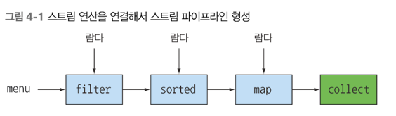
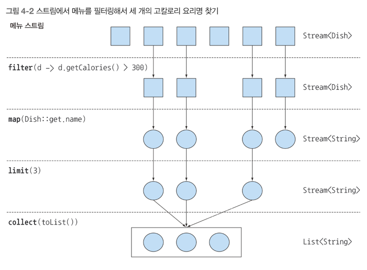

# 함수형 데이터 처리
## 스트림 소개
### 스트림이란 무엇인가?
### 컬렉션과 스트림
### 내부 반복과 외부 반복
### 중간 연산과 최종 연산

컬렉션이 없다면 무슨일이 벌어질까? 거의 모든 자바 어플리케이션은 컬렉션을 만들고 처리하는 과정을 포함한다<br>
즉 컬렉션으로 데이터를 그룹화하고 처리할 수 있다<br>
많은 요소를 포함하는 커다란 컬렉션은 어떻게 처리해야 할까? <br>
성능을 높이려면 멀티코어 아키텍쳐를 활용해서 병렬로 컬렉션의 요소를 처리해야 한다<br>
하지만 병렬 처리 코드를 구현하는 것은 단순 반복 처리 코드에 비해 복잡하고 어렵다 <br>
그래서 나온게 바로 스트림이다 

### 스트림이란 무엇인가?
스트림을 이용하면 선언형(즉, 데이터를 처리하는 임시구현 코드 대신 질의로 표현할 수 있다) 으로 컬렉션 데이터를 처리할 수 있다<br>
일단 스트림은 데이터 컬렉션 반복을 멋지게 처리하는 기능이라고 생각하자. 또한 스트림을 이용하면 멀티스레드 코드를 구현하지 않아도 데이터를 투명하게 병렬로 처리가 가능하다<br>
다음 예시를 봐보자
```java
List<Dish> lowCaloricDishes = new ArrayList<>();
for(Dish dish : menu) {
	if(dish.getCalories() < 400) {
		lowCaloricDishes.add(dish);
        }
    }

Collection.sort(lowCaloricDishes, new Comparator<Dish>() {
	public int compare(Dish dish1, Dish dish2) {
		return Integer.compare(dish1.getCalories(), dish2.getCalories());
	}
});

List<String> lowCaloricDishesName = new ArrayList<>();
for(Dish dish : lowCaloricDishes) {
	    lowCaloricDishesName.add(dish.getName()); // 정렬된 리스트를 처리하면서 요리 이름 선택
    }
```

위 코드를 스트림으로 바꾸어 보겠다.
```java
public class StreamEx {
	List<String> lowCaloricDishesName = menu.stream()
        .filter(d -> d.getCalories() < 400) // 400 칼로리 이하의 요리 선택
        .sorted(comparing(Dish::getCalories)) // 칼로리로 요리 정렬
        .map(Dish::getName) // 요리명 호출
        .collect(toList()); // 모든 요리명을 리스트에 저장
}
```

위 코드 stream() 을 parallelStream() 으로 바꾸면 이 코드를 멀티코어 아키텍처에서 병렬로 실행할 수 있다<br>
```java
List<String> lowCaloricDishesName = menu.parallelStream()
    .filter(d -> d.getCaloris() < 400)
	.sorted(comparing(Dish::getCalories)) // 칼로리로 요리 정렬
	.map(Dish::getName) // 요리명 호출
	.collect(toList()); // 모든 요리명을 리스트에 저장
```

parallelStream() 을 호출할 때 정확히 무슨일이 일어날까? 얼마나 많은 스레드가 사용되는 걸까? <br>
얼마나 성능이 좋은걸까? 라는 궁금증이 생길 수 있습니다 <br>
일단 스트림의 새로운 기능이 소프트웨어 공학적으로 다양한 이득을 준다는 것을 알면 된다
- 선언형으로 코드를 작성할 수 있다.if 조건문 등 제어 블록 필요 없이, 필요한 동작만 수행시킬 수 있다.
- filter,map.sorted,collect 같은 여러 빌딩 블록 연산을 연결해 데이터 처리 파이프라인을 만들 수 있다
- 즉 가독성과 명확성이 유지된다.

결과적으로 데이터 처리과정을 병렬화 하면서 스레드와 락을 걱정할 필요가 없다. 모두 스트림 API 덕분이다.


스트림 API는 매우 비싼 연산이다. 
```java
Map<Dish.Type, List<Dish>> dishesByType = menu.stream().collect(groupingBy(Dish::getType));
```

자바8 의 스트림 API 특징
1) 선언형 : 더 간결하고 가독성이 좋아진다.
2) 조립가능 : 유연성이 좋아진다.
3) 병렬화 : 성능이 좋아진다.


### 스트림 시작하기
스트림의 정의가 무엇일까? <br>
'데이터 처리 연산을 지원하도록 소스에서 추출된 연속된 요소로 정의할 수 있다.'

- 연속된 요소 : 컬렉션과 마찬가지로 스트림은 특정 요소 형식으로 이루어진 연속된 값 집합의 인터페이스를 제공한다 
컬렉션은 자료구조 이므로 컬렉션에서는 시간과 공간의 복잡성과 관련된 요소 저장 및 접근 연산이 주를 이룬다 
,반면 스트은 filter, sorted, map 처럼 표현 계산식이 주를 이룬다. 즉, 컬렉션의 주제는 데이터고 스트림의 주제는 계산이다<br>
- 소스 : 스트림은 컬렉션, 배열, I/O 자원 데이터 제공 소스로부터 데이터를 소비한다. 정렬된 컬렉션으로 스트림을 생성하면 정렬이 그대로 유지 된다
즉, 리스트로 스트림을 만들면 스트림의 요소는 리스트의 요소와 같은 순서를 유지한다.
- 데이터 처리 연산 : 스트림은 함수형 프로그래밍 언어에서 일반적으로 지원하는 연산과 데이터베이스와 비슷한 연산을 지원한다. 
  - 스트림 연산은 순차적으로 또는 병렬로 실행할 수 있다.

또한 스트림에는 다음과 같은 두 가지 중요 특징이 있다.
- 파이프라이닝 : 대부분의 스트림 연산은 스트림 연산끼리 연결해서 커다란 파이프라인을 구성할 수 있도록 스트림 자신을 반환한다.
- 내부 반복 : 반복자를 이용해서 명시적으로 반복하는 컬렉션과 달리 스트림은 내부 반복을 지원한다.


1) filter -> 람다를 인수로 받아 스트림에서 특정 요소를 제외시킨다. // 조건 걸기 
2) map -> 람다를 이용해서 한 요소를 다른 요소로 변환하거나, 정보를 추출한다.  // 데이터 변환 및 추출
3) limit -> 정해진 개수 이상으 요소가 스트림에 저장되지 못하게 제한한다.
4) collect -> 스트림을 Array 든, list 로든 변환한다. 



#### 4.3 스트림과 컬렉션
자바의 기존 컬렉션과 새로운 스트림 모두 연속된 요소 형식의 값을 저장하는 자료구조의 인터페이스를 제공한다 <br>
여기서 '연속된' 이라는 표현은 순서와 상관없이 아무 값에나 접속하는 것이 아닌, 순차적으로 값에 접근한다는 것을 의미한다 <br>

이제 컬렉션과 스트림의 차이를 알아보자.


