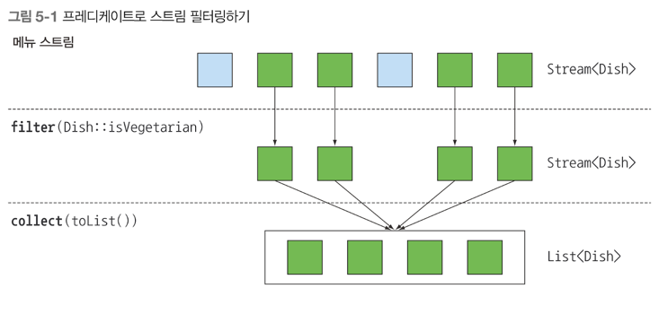
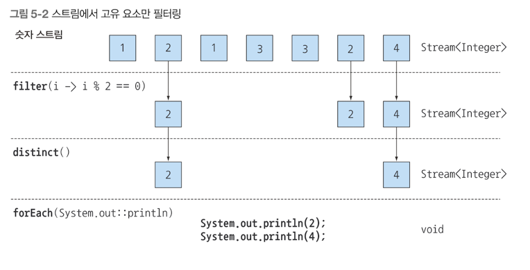
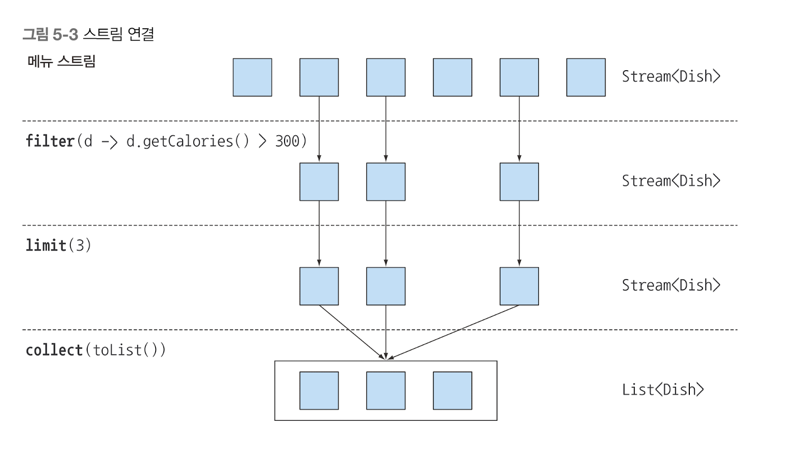
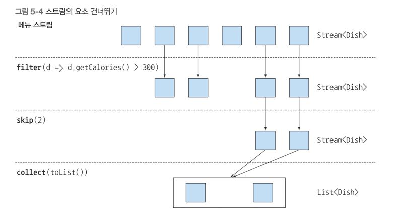
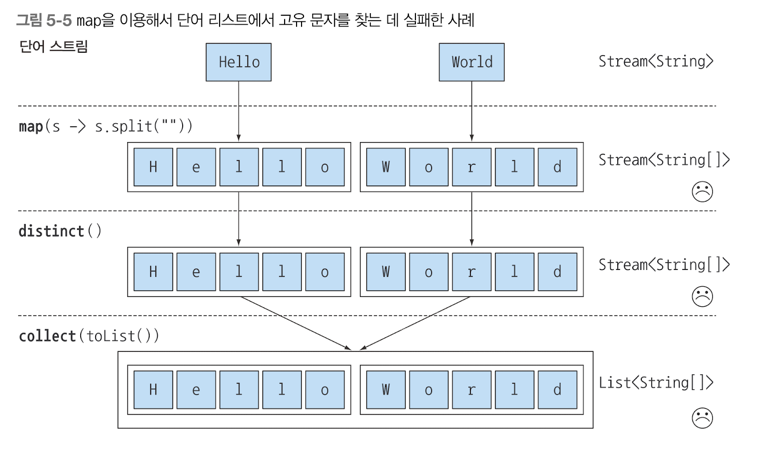
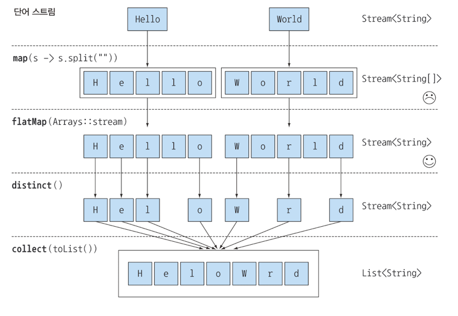
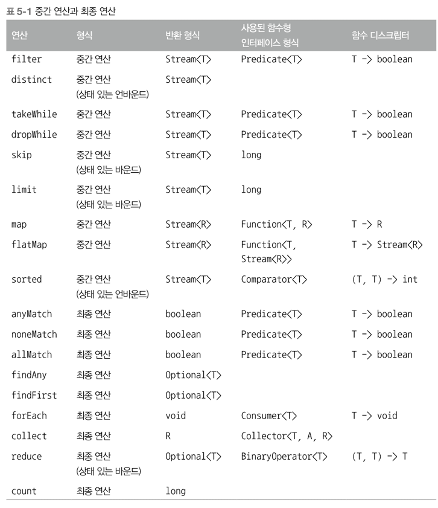
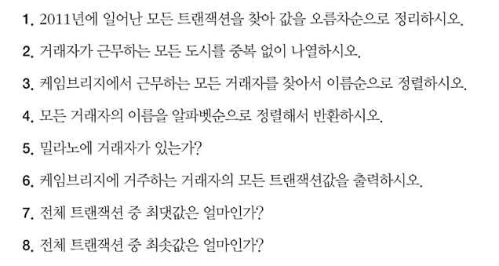

## 스트림 활용
### 필터링, 슬라이싱, 매칭
### 검색, 매칭, 리듀싱
### 특정 범위와 숫자와 같은 숫자 스트림 사용하기
### 다중 소스로부터 스트림 만들기
### 무한 스트림

4장에서는 스트림을 이용해서 외부 반복 -> 내부 반복으로 바꾸는 방법을 알아봤다.
```java
List<Dish> vegetarianDishes = new ArrayList<>();
for(Dish d: menu) {
	if(d.isVegetarian()) {
    vegetarianDishes.add(d);
    }
}

// 위 외부 반복 코드를 내부 반복코드로 만든다.

List<Dish> getVegetarianDishes = menu.stream()
    .filter(Dish::isvegetarian)
    .collect(toList());
```

데이터를 어떻게 처리할지는 스트림 API가 관리하므로 편리하게 데이터 관련 작업을 할 수 있다 <br>
따라서 스트림 API 내부적으로 다양한 최적화가 이루어질 수 있다 <br>
스트림 API는 내부 반복 뿐 아니라 코드를 병렬로 실행할지 여부도 결정할 수 있다 <br>
이러한 일은 순차적인 반복을 단일 스레드로 구현하는 외부 반복으로는 달성할 수 없다 <br>

### 필터링
스트림의 요소를 선택하는 방법, 즉 Predicate 필터링 방법과 고유 요소만 필터링하는 방법을 배운다

#### 프리디케이트로 필터링
스트림 인터페이스는 filter 메소드를 지원한다.<br>
filter 메소드는 Predicate(= return boolean) 을 인수로 받아서 Predicate 와 일치하는 모든 요소를 포함하는 스트림을 반환한다 <br>
예시를 봐보자
```java
List<Dish> vegetarianMenu = menu.stream()
    .filter(d -> dish.isvegetarian()) // 채식 요리인 것만 뽑아내는 람다식
    .collect(toList());
```



#### 고유 요소 필터링 (distinct)
스트림은 고유 요소로 이루어진 스트림을 반환하는 distinct 메소드도 지원한다 <br>
-> 고유 여부는 스트림에서 만든 객체의 hashcode, equals 로 결정된다 <br>
```java
List<Integer> numbers = Arrays.asList(1,2,3,41,5,16);
numbers.stream()
    .filter(i -> i%2 ==0)
    .distinct()
    .forEach(System.out::println);
```


위 순서대로 고유요소만 필터링이 작업이 된다. 

#### 스트림 슬라이싱 (takeWhile, dropWhile)
스트림의 요소를 선택하거나 스킵하는 다양한 방법이 있다.<br>
Predicate 를 이용하는 방법, 스트림의 처음 몇개의 요소를 무시하는 방법, 특정 크기로 스트림을 줄이는 방법 등 다양한 방법을 이용해 효율적으로 작업을 수행한다 <br>

TakeWhile 활용 <br>
```java
List<Dish> sliceMenu1 = specialMenu.stream()
    .takeWhile(dish -> dish.getCalories() < 320)
    .collect(toList());
```

위 takeWhile() 을 사용하면, 원하는 요소가 발견되었을 때 계속 스트림을 돌리는게 아닌, 반복 작업을 중단한다.

DropWhile 활용 <br>
dropWhile 은 Predicate 가 처음으로 거짓이 되는 지점까지 발견된 요소를 버린다 <br>
Predicate 가 거짓이 되면 그 지점에서 작업을 중단하고 남은 모든 요소를 반환한다 <br>
dropWhile 은 무한한 남은 요소를 가진 무한 스트림에서도 동작한다
```java
List<Dish> sliceMenu2 = specialMenu.stream()
    .dropWhile(dish -> dish.getCalories() < 320)
    .collect(toList());
```

#### 스트림 축소 (limit)
filter 와 조합해서 많이 사용하며, 원하는 개수까지만 요소를 뽑아낸다
```java
List<Dish> dishes = specialMenu.stream()
    .filter(dish -> dish.getCalories() > 300)
    .limit(3)
    .collect(toList());
```



정렬되지 않은 스트림에도 limit를 사용할 수 있다. 그러면 limit 의 결과도 정렬되지 않은 상태로 반환된다.<br>
그리고 limit 은 순서대로 처음 등장하는 것부터 n 개 까지만 출력하게끔 한다.

#### 요소 건너뛰기(skip)
스트림은 <b style="color:red">처음 n개 요소를 제외 </b> 한 스트림을 반환하는 skip() 메소드를 지원한다 <br>
limit(n) 과 skip(n) 은 상호보완적인 연산을 수행한다. 아례 예시를 보자
```java
List<Dish> dishes = menu.stream()
    .filter(d -> d.getCalories() > 300)
    .skip(2)
    .collect(toList());
```



위 경우는 앞에 2가지 값을 제외하고 그 이후부터 요소를 뽑아낸다.

### 매핑
특정 객체에서 특정 데이터를 선택하는 작업은 데이터 처리과정에서 자주 수행되는 연산이다 <br>
ex) sql 테이블에서 특정 열만 선택한다. 이 과정을 스트림에서 map, flatMap 메소드를 사용해서 할 수 있다.

#### 스트림의 각 요소에 함수 적용하기
스트림은 함수를 인수로 받는 map 메소드를 지원한다. 인수로 제공된 함수는 각 요소에 적용되며 함수를 적용한 결과가 새로운 요소로 매핑된다 <br>
위 과정을 '변환' -> '매핑' 이라고 한다. 예시를 보자
```java
List<String> dishNames = menu.stream()
    .map(Dish::getName)
    .collect(toList());
```

getName 을 통해 Dish 에 있는 이름(문자열)을 반환하여 스트림에 저장한다 <br>
다른 예시를 봐보자, List 의 단어 길이를 저장하는 예제이다.
```java
List<String> words = Arrays.asList("Modern","Java","In","Action");
List<Integer> wordLengths = words.stream()
    .map(String::length)
    .collect(toList());
```

다른 예제를 보자, 요리명만 추출한 후 길이를 저장하는 예제이다
```java
List<Integer> cookName = menu.stream()
    .map(Dish::getName)
    .map(String::length)
    .collect(toList());
```

#### 스트림 평면화

List 에 있는 단어를 문자로 매핑 후 한 단어씩 저장되게 만들어보자
```java
List<String> list = word.stream()
    .map(word -> word.split(""))
    .distinct()
    .collect(toList());
```

위 코드에서 map 으로 전달한 람다는 각 단어의 String[] 을 반환한다 <br>
따라서 map 메소드가 반환한 스트림 형식은 Stream<String[]> 이다 <br>
우리가 원하는 것은 문자열의 스트림을 표현할 Stream<String> 이다 <br>


위 문제를 해결하기 위해 flatMap 이라는 메소드를 이용해서 문제를 해결한다 <br>

#### map 과 Arrays.stream 활용
우선 배열 스트림 대신 문자열 스트림이 필요하다 <br>
```java
String[] arrayOfWords = {"GoodBye","World"};
Stream<String> streamOfWords = Arrays.stream(arrayOfWords);
```

위 코드를 Arrays.stream() 을 적용해보자
```java
words.stream()
    .map(word -> word.spilt(""))
    .map(Arrays::stream)
    .distinct()
    .collect(toList());
```

아직 문제가 해결되지 않았다. 

#### flatMap 사용
flatMap 을 사용하면 문제를 해결할 수 있었다
```java
List<String> uniqueChars = words.stream()
    .map(word -> word.spilt("")) // 각 단어를 개별 문자를 포함하는 배열로 변환
    .flatMap(Arrays::stream) // 생성된 스트림을 하나의 스트림으로 평면화
    .distinct()
    .collect(toList());
```

flatMap 은 각 배열을 스트림이 아닌 스트림의 콘텐츠로 매핑한다. 즉, map(Arrays::stream) 과 달리 flatMap 은 하나의 평면화된 스트림을 반환한다 <br>
요약하면 flatMap 메소드는 스트림의 각 값을 다른 스트림으로 만든 다음에 모든 스트림을 하나의 스트림으로 연결하는 기능을 수행한다.



### 검색과 매칭
특정 속성이 데이터 집합에 있는지 여부를 검색하는 데이터 처리도 자주 사용된다 <br>
스트림 API 는 allMatch, anyMatch, noneMatch, findFirst, findAny 등 다양한 유틸리티 메소드를 제공한다 <br>

#### Predicate 가 적어도 한 요소와 일치하는지 확인
Predicate 가 주어진 스트림에서 적어도 한 요소와 일치하는지 확인할 때 anyMatch 메소드를 이용한다 <br>
```java
if(menu.stream().anyMatch(Dish::isVegetarian)) {
    System.out.println("The menu is (somewhat) vegetarian friendly!");	
}
```

anyMatch 는 boolean 을 반환하는 최종 연산이다. 

#### Predicate 가 모든 요소와 일치하는지 검사
allMatch 메소드는 모든 요소가 주어진 Predicate 와 일치하는지 검사한다.
```java
boolean isHealthy = menu.stream().allMatch(dish -> dish.getCalories() < 1000);
```

#### noneMatch
allMatch 와 반대되는 연산을 한다. 일치한ㄴ 요소가 없는지 체크한다.
```java
boolean isHealthy = menu.stream().noneMatch(dish -> dish.getCalories() < 1000);
```

위 세가지 메소드는 스트림 쇼트서킷 기법, 즉 자바의 &&, || 연산을 활용한다.

### 요소 검색
findAny 는 현재 스트림에서 임의의 요소를 반환한다. 
```java
Optional<Dish> dish = menu.stream()
    .filter(Dish::isVegetarian)
    .findAny();
```

스트림 파이프라인은 내부적으로 단일 과정으로 실행할 수 있도록 최적화된다. 즉 쇼트서킷을 이용해서 결과를 찾는 즉시 실행을 종료한다

#### Optional 이란?
Optional<T> 클래스는 값의 존재나 부재 여부를 표현하는 컨테이너 클래스다.<br>
null 은 쉽게 에러를 일으킬 수 있으므로 자바8 에서 Optional<T> 클래스가 만들어졌다 <br>
Optional 을 통해서 null 관련 버그를 피해갈 수 있다 <br>
Optional 은 값이 존재하는지 확인하고 값이 없을 때 어떻게 처리할지 강제하는 기능을 제공한다는 것만 알아두자

#### 첫 번째 요소 찾기
리스트 또는 정렬된 연속 데이터로부터 생성된 스트림처럼 일부 스트림에는 논리적인 아이템 순서가 정해져 있을 것이다 <br>
이런 스트림에서 첫 번째 요소를 찾으려면 어떻게 해야할까?
```java
List<Integer> someNumbers = Arrays.asList(1,2,3,4,5);
Optional<Integer> first = someNumbers.stream()
    .map(n -> n*n)
    .filter(n -> n%3 ==0)
    .findFirst();
```

findFirst 와 findAny 는 언제 사용할까요? <br>
바로 병렬성 때문이다. 병렬 실행에서는 첫 번째 요소를 찾기 어렵다. 따라서 요소의 반환 순서가 상관없다면 병렬 스트림에서는 제약이 적은 findAny 를 사용한다 <br>

### 리듀싱
#### 요소의 합
```java
int sum = 0;
for (int x : numbers) {
	sum += x;
}
```
numbers 의 각 요소는 결과에 반복적으로 더해진다. 위 코드를 reduce 를 사용해 보겠다
```java
int sum = numbers.stream().reduce(0, (a,b) -> a+b);

```

reduce 는 두 개의 인수를 갖는다. 메소드 참조를 이용해서 더 간단하게 줄여보겠다
```java
int sum = numbers.stream().reduce(0, Integer::sum);
```

#### 최댓값과 최솟값
reduce 는 두 인수를 받는다 <br>
- 초깃값
- 스트림의 두 요소를 합쳐서 하나의 값으로 만드는데 사용할 람다

```java
Optional<Integer> max = numbers.stream().reduce(Integer::max);

Optional<Integer> min = numbers.stream().reduce(Integer::min);
```

Integer::min 대신 람다 표현식 (x,y) -> x<y ? x:y 를 써도 무방하긴 하다. <br>

reduce 메소드의 장점과 병렬화 <br>
map 과 reduce 를 연결하는 기법을 맵 리듀스 패턴이라고 한다. 쉽게 병렬화 하는 특징이 있어 자주 쓰인다 <br>

#### 스트림연산 : 상태 없음과 상태 있음
컬렉션으로 스트림을 만드는 stream 메소드를 parallelStream 으로 바꾸는 것만으로도 별다른 노력 없이 병렬성을 얻을 수 있다 <br>


### 실전 연습


<a href="https://hyeonq.tistory.com/158"> 필자 티스토리에 정리를 해서 올려 두었으니 궁금하면 봐보시길 </a>


### 숫자형 스트림

reduce 메소드로 스트림 요소의 합을 구하는 예제를 봤다 
```java
int calories = menu.stream()
    .map(Dish::getCalories)
    .reduce(0, Integer::sum);
```

위 코드에느 박싱 비용이 숨어있다 <br> 
내부적으로 합계를 계산하기 전에 Integer를 기본형으로 언박싱해야 한다. 다음 코드처럼 직접 sum 메소드를 호출할 수 있다면 더 좋지 않을까?
```java
int calories = menu.stream()
    .map(Dish::getCalories)
    .sum();
```

하지만 위 코드처럼 sum 메소드를 직접 호출할 수 없다. map 메소드가 Stream<T> 를 생성하기 때문이다. <br>
스트림의 요소 형식은 Integer 지만 인터페이스에는 sum 메소드가 없다. 왜 일까? <br>
ex) Menu 처럼 Stream<Dish> 형식의 요소만 있다면 sum 이라는 연산을 수행할 수 없기 때문이다 <br>
다행히도 스트림 API 숫자 스트림을 효율적으로 처리할 수 있도록 기본형 특화 스트림을 제공한다.

#### 기본형 특화 스트림


