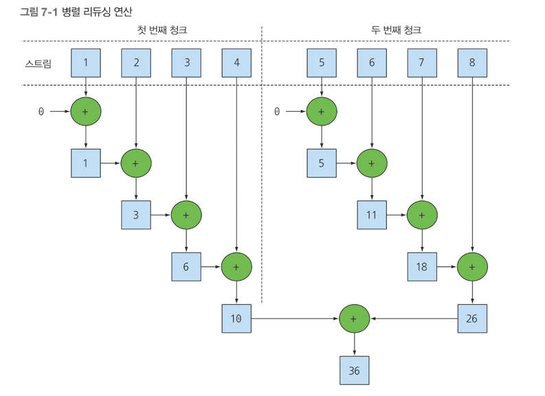

## 병렬 데이터 처리와 성능
- 병렬 스트림으로 데이터를 병렬 처리하기
- 병렬 스트림의 성능 분석
- 포크/조인 프레임워크
- Spliterator 로 스트림 데이터 쪼개기

자바7 이후에서는 더 쉽게 병렬화를 수행하면서 에러를 최소화 할 수 있도록 포크/조인 프레임워크 기능을 제공한다 <br>
스트림을 이용하면 순차 스트림을 병렬 스트림으로 자연스럽게 바꿀 수 있다. <br>

### 병렬 스트림
컬렉션에 parallelStream 을 호출하면 병렬 스트림이 생성된다. <br>
병렬 스트림이란 각각의 스레드에서 처리할 수 있도록 스트림 요소를 여러 청크로 분할한 스트림 입니다 <br>
따라서 병렬 스트림을 이용하면 모든 멀티코어 프로세서가 각각의 청크를 처리하도록 할당할 수 있다 <br>

숫자 n 을 인수로 받아 1 ~ n 까지 모든 숫자의 합계를 반환하는 메소드를 구현해보자
```java
public Long sequentialSum(long n) {
	return Stream.iterater(1L, i -> i+1) // 무한 자연수 스트림 생성
        .limit(n) // n개 이하로 결과값 제한
        .reduce(0L, Long::sum); // 모든 숫자를 더하는 스트림 리듀싱 연산
}

// 전통적인 자바 방식
public long iterativeSum(long n) {
	long result = 0;
	for (long i = 1L; i <= n ; i++) {
        result += i;
	}
	return result;
}
```

n이 작다면 문제가 없지만, n이 커진다면 이 연산을 병렬로 처리하는 것이 좋을 것이다. 

그럼 어떻게 병렬로 처리하나요? <br>
간단합니다. 스트림 중간 연산에 parallel() 메소드를 껴 넣어두면 됩니다.

#### 순차 스트림을 병렬 스트림으로 변환하기
순차 스트림에 parallel 메소드를 호출하면 기존으 함수형 리듀싱 연산(숫자 합계 연산)이 병렬로 처리가 된다.
```java
public long parallelSum(long n) {
	return Stream.iterate(1L, i -> i+1)
        .limit(n)
        .parallel() // 순차적 -> 병렬 로 변환
        .reduce(0L, Long::sum);
}
```

청크 : 데이터 자체를 의미하는 덩어리 (=데이터가 차지하는 메모리 공간) <br>
parallel() 을 사용하면 , 리듀싱 연산을 여러 청크에 병렬로 수행할 수 있다.


사실 순차 스트림에 parallel 을 호출해도 스트림 자체에는 아무 변화도 일어나지 않는다 <br>
내부적으로는 parallel 을 호출하면 이후 연산이 병렬로 수행해야 함을 의미하는 boolean 플래그가 설정된다 <br>
반대로 sequential 로 병렬 스트림을 순차 스트림으로 바꿀 수 있다. <br>
이 두 메서드를 이용해서 병렬 -> 순차 , 순차 -> 병렬 로 제어할 수 있다 .<br>
```java
stream.parallel()
.filter()
.sequential()
.map()
.parallel()
.reduce();
```

parallel 이 선언되고, sequential 이 선언되고, 최종적으로 parallel 이 선언되었다. <br>
⭐️Stream 에서는 전체 파이프라인에서 최종적으로 선언되는 메소드가 전체 파이프라인에 영향을 끼친다 <br>

#### 병렬 스트림에서 사용하는 스레드 풀 설정
스트림은 parallel 메소드에서 병렬로 작업을 수행하는 스레드는 어디서 생성되는 것이며, 몇개나 생성되는지, 그리고 그 과정을 어떻게 커스터마이징 할까? <br>
병렬 스트림은 내부적으로 ForkJoinPool 을 사용한다.<br>
기본적으로 ForkJoinPool 은 프로세스 수, 즉 Runtime.getRuntime(),availableProcessors() 가 반환하는 값에 상응하는 스레드를 갖는다 <br>

#### 스트림 성능 측정
병렬화를 이용하면 순차나 반복 형식에 비해 성능이 더 좋아질 것이라 추측했다. <br>
소프트웨어 공학에서 추측은 위험한 방법입니다 <br>
그래서 JMH 라이브러리를 이용해 성능을 측정 해볼 것입니다.

```java
@BenchmarkMode(Mode.AverageTime)
@OutputTimeUnit(TimeUnit.MILLISECONDS)
@Fork(value = 2, jvmArgs = {"-Xms4G", "-Xms4G"})
public class ParallelStreamBenchMark {
	private static final long N = 10_000_000L;

	@Benchmark
	public long sequentialSum() {
		return Stream.iterate(1L, i -> i+1)
			.limit(N)
			.reduce(0L, Long::sum);
	}

	@TearDown(Level.Invocation)
	public void reset() {
		System.gc(); // 벤치 마크 실행 후 가바지 컬렉터 동작 시키기
	}


}
```

내가 코드 작성한 경로에서 ./gradlew jmh 를 통해서 실행시킬수 있다 <br>


