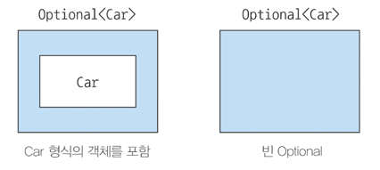
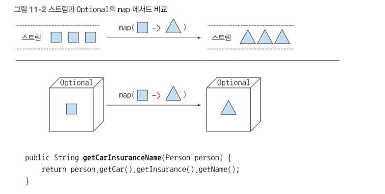

## null 대신 Optional 클래스
- null 참조의 문제점과 null 을 멀리해야 하는 이유
- null 대신 Optional: null 로부터 안전한 도메인 모델 재구현하기
- Optional 활용: null 확인 코드 제거하기
- Optional 에 저장된 값을 확인하는 방법
- 값이 없을 수도 있는 상황을 고려하는 프로그래밍

Java 로 개발을 하다보면 NullPointException 은 무조건 한 번씩은 보게 된다. <br>
 
### 값이 없는 상황을 어떻게 처리할까?
예시에서는 자동차와 자동차 보험을 가지고 있는 사람 객체를 중첩 구조로 구현했다고 하자

```java
public class Person {
	private Car car;
	public Car getCar () {
		return car;
	}

}

public class Car {
	private Insurance insurance;
	public Insurance getInsurance () {
		return insurance;
	}
}

public class Insurance {
	private String name;
	public String getName() {
		return name;
    }
}

// 문제 상황
public String getCarInsuranceName(Person person) {
	return person.getCar().getInsurance().getName();
}
```

겉으러 보면 위 코드는 문제가 없다, 하지만 차가 없거나 보험이 없는 사람이라면? <br>
이런 경우에는 NullPointException 이 터질 것이다.

#### 보수적인 자세로 NPE 줄이기
NPE 를 피하려면 어떻게 할까? 보통 프로그래머들은 Null 확인 코드를 추가해서 예외 문제를 해결한다 <br>
```java
public String getCarInsuranceName(Person person) {
	if(person != null) {
		Car car = person.getCar();
		if(car != null) {
			Insurance insurance = car.getInsurance();
			if(insurance != null) {
				return insurance.getName();
			}
		}
	}
}
```

위 코드처럼 모든 객체를 참조할때 마다 null 체크를 하는 상황이 발생한다. 얼마나 귀찮을까..<br>
이 문제를 해결하는 코드를 보자
```java
public String getCarInsuranceName(Person person) {
	if(person==null) {
		return "Unknown person";
	}
	Car car = person.getCar();
	if(car==null) {
		return "Unknown car";
	}
	Insurance insurance = car.getInsurance();
	if(insurance==null) {
		return "Unknown insurance";
	}
	return insurance.getName();
}
```

위 코드도 개선을 하기는 했지만, 조금 더 개선을 할 필요가 있다. 

#### Null 때문에 발생하는 문제
- 에러의 근원이다: NPE 는 자바에서 가장 흔히 발생하는 에러이다.
- 코드를 어지럽힌다: 때로는 중첩된 null 확인 코드를 추가해야 하므로 null 때문에 코드 가독성이 떨어진다
- 아무 의미가 없다: null 은 아무 의미도 표현하지 않는다. 특히 정적 형식 언어에서 값이 없음을 표현하는 방법으로 적절하지 않다.
- 자바 철학에 위배: 자바는 개발자로부터 모든 포인터를 숨겼다. 하지만 예외가 있는 데 그것이 바로 npe 이다.
- 형식 시스템에 구멍을 만든다: null 은 형식이 없고 정보를 포함하지 않아 모든 랩퍼 형식에 null 할당이 가능하다. 
  - 이런식으로 null 이 할당되면서 시스템의 다른 부분으로 null 이 퍼질 때 null 이 어떤 의미로 사용되었는지 알 수 없다.

### Optional 클래스 소개
Optional 은 선택형 값을 캡슐화하는 클래스다. <br>
Optional 을 이용하여 null 을 할당하는 것이 아닌 빈값을 의미시킨다. 

값이 있으면 Optional 클래스는 값을 감싼다. <br>
값이 없으면 Optional.empty 메소드로 Optional 을 반환한다 <br>
Optional.empty 는 Optional 의 특별한 싱글턴 인스턴스를 반환하는 정적 팩토리 메소드다 <br>
null 참조 Optional.empty() 는 서로 무엇이 다를까?, 의미상은 비슷하지만 실제로는 차이점이 많다 <br>
null 을 참조하면 NPE 가 발생하지만, Optional.empty 는 Optional 객체 이므로 다양한 방식으로 활용한다 <br>
즉 Optional 로 객체를 감싸면, 값이 없을 수도 있음을 명시적으로 보여준다는 것이다. <br>
```java
public class Person {
	private Optioanl<Car> car;
	public Optional<Car> getCar() {
		return car;
    }
}

public class Car {
	private Optional<Insurance> insurance;
	public Optional<Insuarance> getInsurance() {
		return insurance;
    }
}

public class Insurance {
	private String name;
	public String getName() {
		return name;
    }
}
```

#### Optional 적용 패턴
#### Optional 객체 만들기
빈 Optional
```java
Optioanl<Car> optCar = Optional.empty();
```

정적 팩토리 메소드 Optional.empty() 로 빈 Optional 객체를 얻는다.

null 이 아닌 값으로 Optional 만들기<br>
또한 정적 팩토리 메소드 Optional.of 로 Null 이 아닌 값을 포함하는 Optional 을 만들 수 있다.
```java
Optioanl<Car> optCar = Optional.of(car);
```

이제 car 가 null 이라면, NPE 가 발생한다. 

null 값으로 Optional 만들기 <br>
정적 팩토리 메소드 Optional.ofNullable 로 null 값을 저장할 수 있는 Optional 을 만들 수 있다.
```java
Optional<Car> optCar = Optional.ofNullable(car);
```

car 가 null 이면 빈 Optional 객체를 반환한다 <br>

#### map 으로 optional 값을 추출하고 변환하기
```java
// 기존 코드
String name = null;
if(insurance != null) {
	name = insurance.getName();
}

// 변경 코드
Optional<Insurance> optInsurance = Optional.ofNullable(insurance);
Optioanl<String> name = optInsurance.map(Insurance::getName);
```

optional 의 map 은 스트림의 map 과 개념적으로 비슷하다. <br>
스트림의 map 은 스트림의 각 요소에 제공된 함수를 적용하는 연산이다 <br>
여기서 optional 객체를 최대 요소의 개수가 한 개 이하인 데이터 컬렉션으로 생각할 수 있다.<br>
Optional 이 값을 포함하면 map 의 인수로 제공된 함수가 값을 바꾼다 <br>
Optional 이 비어있으면 아무일도 일어나지 않는다. <br>


#### flatMap 으로 Optional 객체 연결


