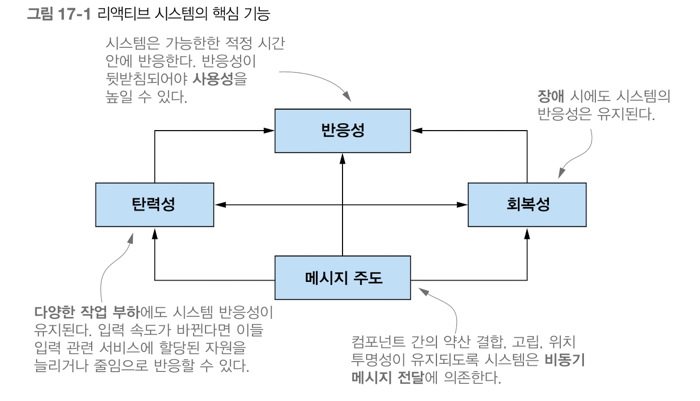

## 17장 리액티브 프로그래밍
- 리액티브 프로그래밍을 정의하고, 리액티브 매니패스토를 확인함
- 애플리케이션 수준, 시스템 수준의 리액티브 프로그래밍
- 리액티브 스트림, 자바9 플로 API 를 사용한 예제코드
- 널리 사용되는 리액티브 라이브러리 RxJava 소개
- 여러 리액티브 스트림을 변환하고 합치는 RxJava 동작 살펴보기
- 리액티브 스트림의 동작을 시각적으로 문서화하는 마블 다이어그램

리액티브 프로그래밍이란 무엇이고 어떻게 동작하는지 확인하기 앞서, 새로운 리액티브 프로그래밍 패러다임의 중요성이 증가하는 이유를 알 필요가 있다  
1) 빅데이터: 빅데이터는 페타바이트 단위로 구성되며 매일 증가한다.
2) 다양한 환경: 멀티 코어 프로세서로 실행되는 클라우드 기반 클러스터에 이르기까지 다양한 환경에 어플리케이션이 배포된다.
3) 사용 패턴: 사용자는 1년 내내 항상 서비스를 이용할 수 있으며 밀리초 단위의 응답 시간을 기대한다.

예전 소프트웨어 아키텍쳐 로는 오늘날의 이런 요구사항을 만족시킬 수 없다  
리액티브 프로그래밍에서는 다양한 시스템과 소스에서 들어오는 데이터 항목 스트림을 비동기적으로 처리하고 합쳐서 이런 문제를 해결한다  

### 리액티브 매니페스토
리액티브 애플리케이션과 시스템 개발의 핵심 원칙을 공식적으로 정의한다.
1) 반응성
2) 회복성
3) 탄력성: 리액티브 시스템에서는 무서운 작업 부하가 발생하면 자동으로 관련 컴포넌트에 할당된 자원 수를 늘린다.
4) 메시지 주도: 비동기 메시지를 전달해 컴포넌트 끼리의 통신이 이루어진다. 회복성과 탄력성을 얻을 수 있다.

#### 애플리케이션 수준의 리액티브
애플리케이션 수준 컴포턴트의 리액티브 프로그래밍의 주요 기능은 비동기로 작업을 수행할 수 있다는 점이다  
